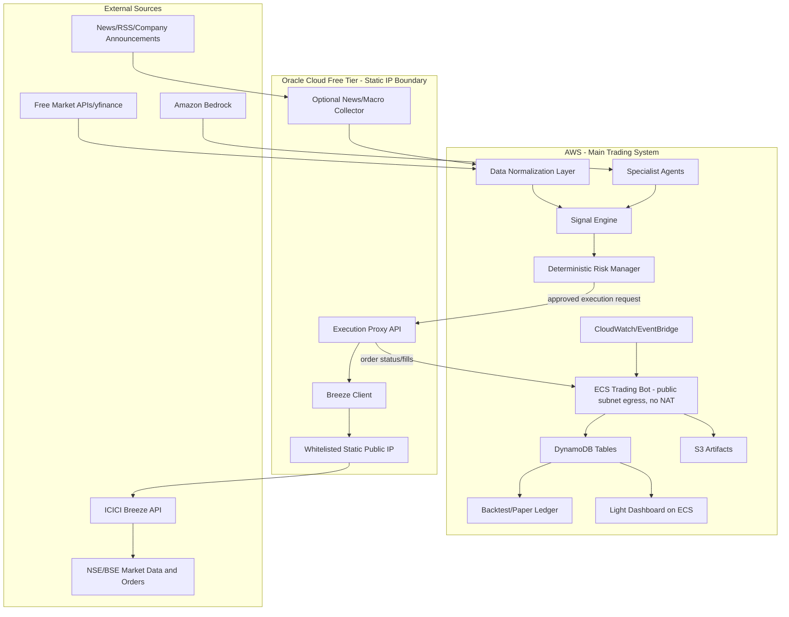
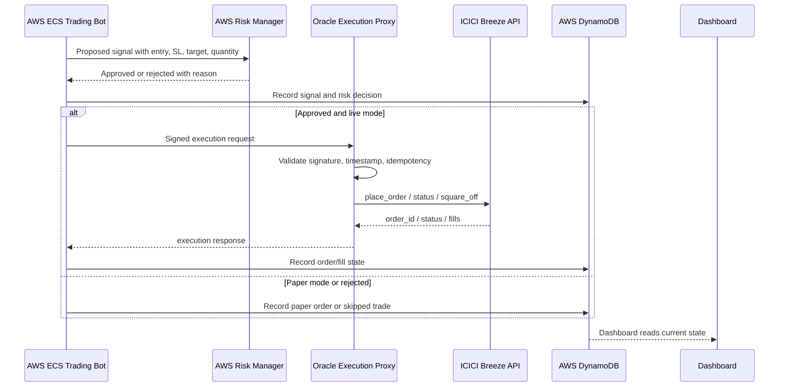

# Trading System Master Project Plan

This is the root-level project plan and tracker for the Indian intraday trading system.

Use this file as the stable source of truth. Do not materially change the architecture, work-package IDs, phase order, or acceptance gates unless a change is recorded in the `Plan Change Log`.

Implementation details and per-module coding notes live in `EXECUTION_GUIDE.md`.

## 1. Objective

Build a robust, well-informed, well-tested intraday trading system for Indian markets.

The system will:

- Analyse historical price action, intraday technicals, global cues, Indian market news, company-specific news, company announcements, sentiment, derivatives/option cues where useful, and recent strategy performance.
- Trade intraday only.
- Execute live orders through ICICI Breeze.
- Use Oracle Cloud because Oracle provides the static public IP required for ICICI Breeze whitelisting.
- Use AWS for the main trading brain, storage, orchestration, dashboard, monitoring, and deployment.
- Provide a small, light dashboard for visibility and control.

Important expectation: the goal is to build a disciplined system with measurable edge and strong risk controls. No software plan can guarantee profit.

## 2. Non-Negotiable Rules

- The LLM/agent may analyse, summarize, and recommend.
- The LLM/agent must not directly place trades.
- Every order must pass through deterministic risk checks.
- Live execution must go through Oracle static-IP execution proxy.
- AWS remains the main system of record and the main trading brain.
- Paper trading is default until all live-readiness gates pass.
- Every signal, skipped trade, risk rejection, order, fill, square-off, and error must be auditable.
- One and only one active live trading leader may place orders.
- Dashboard manual actions must still pass backend safety checks.

## 3. Current Repository Baseline

The current repo already contains useful pieces. The plan is to reuse and refactor them, not rewrite blindly.

| Area | Existing Files | Current State | Plan |
|---|---|---|---|
| AWS CDK | `app.py`, `cicd/cdk/stacks/*.py` | Creates/imports IAM, VPC, Cognito, DynamoDB/S3, ECS services, dashboard ALB. | Keep, then align runtime/env with Oracle proxy and safe ECS topology. |
| Trading runtime | `agent/main.py` | Main market-hours bot exists, but mixes config, orchestration, risk, execution, persistence, and timing. | Keep as entry point, gradually move config/risk/execution/contracts into focused modules. |
| Specialist agents | `agent/specialists/*.py` | Technical/sentiment/fundamental/derivatives mostly exist; `social.py` is empty. Constructors and data contracts need cleanup. | Keep and normalize. Add deterministic feature extraction before LLM synthesis. |
| Market data | `agent/tools/market_data.py`, `mcp-servers/market_data_server.py` | Breeze/yfinance ideas exist; return shapes are inconsistent. | Normalize OHLCV/quote contracts. Add stale-data validation. |
| News/macro | `agent/overnight/*.py`, `agent/tools/news_fetcher.py` | Overnight and real-time news collection exists. | Keep. Move Oracle collector/cache boundary into explicit client/API. |
| Learning | `agent/learning/*.py` | Pattern analysis and confidence adjustment exist, but depend on reliable trade records. | Keep. Use only after paper/backtest evidence is recorded. |
| Execution | `agent/tools/order_execution.py`, `mcp-servers/trading_execution_server.py` | Direct Breeze execution from app code exists. | Refactor. AWS must call Oracle execution proxy for live orders. Direct Breeze kept only for proxy/reference/mock. |
| Dashboard | `containers/dashboard/*` | Simple FastAPI/static dashboard exists. Some path/health details need fixing. | Keep light. Add mode, risk, signals, skipped trades, positions, square-off control. |
| Containers | `containers/trading-bot/*`, `containers/dashboard/*` | Dockerfiles exist. Trading entrypoint expects `ECSCompatibleBot`, while current runtime has `TradingBot`. | Fix entrypoint/runtime mismatch. |
| GitHub deploy | `.github/workflows/*.yml`, `cicd/ecstasks_unused/*.json` | ECS deploy workflow and scheduled workflow exist, but need alignment with CDK and Oracle proxy. | Keep after cleanup. Add CI gates before deploy. |
| Generic services | `services/*` | Larger agent-platform scaffolding exists, much not specific to trading. | Do not make it the critical path unless a module is directly useful. |
| Prototype | `src/trader.py` | Prototype/sketch with duplicate functions and undefined names. | Do not use in production. Keep as reference only or archive later. |

## 4. Target Architecture



## 5. Live Execution Flow



## 6. Should We Deploy Infra First?

Yes, but only the right kind of infra first.

Do not deploy the full live-trading path before interfaces and safety gates are clear. The recommended sequence is:

1. Define contracts and tests for signals, risk decisions, orders, fills, and Oracle proxy requests.
2. Deploy minimal Oracle proxy infrastructure with mock Breeze mode.
3. Deploy AWS base infrastructure: DynamoDB/S3, ECS, dashboard, monitoring. Use public-subnet ECS egress without NAT Gateway; ICICI static-IP execution stays on Oracle.
4. Deploy containers in paper mode.
5. Run paper trading and backtests.
6. Enable live Breeze only after live-readiness gates pass.

This is "infrastructure-first, but contract-led."

## 7. Phase Plan And Tracker

Status values:

- `Not started`
- `In progress`
- `Blocked`
- `Implemented`
- `Tested`
- `Released`

### Phase 0 - Baseline, Contracts, And Repo Hygiene

| ID | Work Package | Status | Primary Files | Required Tests | Definition Of Done |
|---|---|---|---|---|---|
| P0-WP01 | Freeze master plan and execution guide | Implemented | `PROJECT_PLAN.md`, `EXECUTION_GUIDE.md` | Markdown review | Stable plan exists at root and drives work. |
| P0-WP02 | Add typed domain contracts | Tested | `agent/contracts/`, `agent/execution/broker.py` | `python -m pytest tests/unit/test_contracts.py -q` -> 12 passed | Signal, order, fill, risk decision, quote, OHLCV schemas validate. |
| P0-WP03 | Fix runtime import/constructor mismatches | Tested | `agent/main.py`, `agent/specialists/*.py`, `containers/trading-bot/entrypoint.sh` | `python -m pytest tests/unit/test_runtime_imports.py tests/unit/test_contracts.py -q` -> 15 passed | Trading container imports the real bot class and specialist constructors work. |
| P0-WP04 | Normalize config loading | Implemented | `agent/config.py`, `cicd/env/prod.json` | Local: `python -m pytest tests/unit/test_config.py -q` -> 4 passed. User VS Code verification pending because runtime import tests still hit SSL in local environment. | Runtime config loads once, validates defaults, and supports AWS/Oracle URLs. |
| P0-WP05 | Decide active deploy path | Tested | `.github/workflows/*.yml`, `app.py`, `cicd/cdk/stacks/*.py`, `cicd/ecstasks_unused/*.json`, `scripts/verify_deploy_path.py` | User VS Code: `python scripts/verify_deploy_path.py` -> passed; `python -m pytest tests/unit/test_deploy_path.py -q` -> 1 passed | CDK is authoritative for AWS infra/ECS services; GitHub deploy builds images then runs CDK; ECS task JSON is legacy/reference only; Oracle is the ICICI static-IP execution boundary. |

### Phase 1 - Oracle Static-IP Execution Proxy

| ID | Work Package | Status | Primary Files | Required Tests | Definition Of Done |
|---|---|---|---|---|---|
| P1-WP01 | Create Oracle proxy app skeleton | Tested | `oracle/execution-proxy/app.py`, `oracle/execution-proxy/Dockerfile`, `oracle/execution-proxy/requirements.txt` | User VS Code: `python -m pytest tests/unit/test_oracle_proxy_health.py -q` -> passed | Proxy exposes health endpoint and mock mode. |
| P1-WP02 | Add signed request authentication | Tested | `oracle/execution-proxy/auth.py`, `agent/execution/oracle_breeze_client.py`, `oracle/execution-proxy/app.py` | User VS Code: `python -m pytest tests/unit/test_oracle_proxy_auth.py tests/unit/test_oracle_proxy_health.py -q` -> passed | Unsigned, expired, replayed, and bad-signature requests are rejected. |
| P1-WP03 | Add Breeze client inside Oracle proxy | Implemented | `oracle/execution-proxy/breeze_client.py`, `oracle/execution-proxy/app.py` | Local: `python -m pytest tests/unit/test_oracle_breeze_client.py tests/unit/test_oracle_proxy_auth.py tests/unit/test_oracle_proxy_health.py -q` -> 12 passed. User VS Code verification pending. | Breeze calls are isolated behind an interface and mockable. |
| P1-WP04 | Add idempotency and duplicate-order protection | Implemented | `oracle/execution-proxy/idempotency.py`, `oracle/execution-proxy/app.py`, AWS order client | Local: `python -m pytest tests/unit/test_order_idempotency.py tests/unit/test_oracle_breeze_client.py tests/unit/test_oracle_proxy_auth.py tests/unit/test_oracle_proxy_health.py -q` -> 14 passed. Per user instruction, not marked Tested. | Same client order ID cannot create duplicate live orders. |
| P1-WP05 | Add Oracle deployment IaC | Implemented | `oracle/scripts/deploy_execution_proxy.sh`, `oracle/scripts/README.md` | Local: `python -m pytest tests/unit/test_oracle_deploy_script.py -q` -> 2 passed; `bash oracle/scripts/deploy_execution_proxy.sh --dry-run` -> passed. Per user instruction, not marked Tested. | Oracle VM/proxy deployment is repeatable. |
| P1-WP06 | Oracle proxy integration test in mock mode | Implemented | `tests/integration/test_oracle_proxy.py`, `agent/execution/oracle_breeze_client.py`, `oracle/execution-proxy/app.py` | Local: `python -m pytest tests/integration/test_oracle_proxy.py -q` -> 1 passed; full Phase 1 local set -> 17 passed. Per user instruction, not marked Tested. | AWS-side client can place mock order through Oracle proxy. |

### Phase 2 - AWS Foundation Infrastructure

| ID | Work Package | Status | Primary Files | Required Tests | Definition Of Done |
|---|---|---|---|---|---|
| P2-WP01 | Validate CDK synth | Implemented | `app.py`, `cicd/cdk/stacks/*.py`, `scripts/verify_cdk_synth.sh` | Local: `bash scripts/verify_cdk_synth.sh` -> synth passed; `python -m pytest tests/unit/test_cdk_synth_script.py -q` -> 2 passed. User VS Code verification pending. | AWS templates synthesize cleanly. |
| P2-WP02 | Align AWS networking with Oracle execution path | Tested | `cicd/cdk/stacks/network_stack.py`, `cicd/env/prod.json`, runtime labels | User VS Code: `python -m pytest tests/unit/test_network_oracle_alignment.py -q` -> passed; `bash scripts/verify_cdk_synth.sh` -> passed | AWS no longer assumes ICICI static IP is AWS NAT if Oracle is execution boundary. |
| P2-WP03 | Review DynamoDB schema for audit | Implemented | `cicd/cdk/stacks/storage_stack.py`, `cicd/cdk/stacks/agent_runtime_stack.py`, `agent/config.py` | Local: `python -m pytest tests/unit/test_storage_audit_schema.py tests/unit/test_config.py tests/unit/test_cdk_synth_script.py -q` -> 10 passed. User VS Code verification pending. | Tables support signals, orders, fills, positions, risk events, market state. |
| P2-WP04 | Fix ECS trading service topology | Implemented | `cicd/cdk/stacks/agent_runtime_stack.py`, `tests/unit/test_ecs_trading_topology.py` | Local: `python -m pytest tests/unit/test_ecs_trading_topology.py tests/unit/test_deploy_path.py tests/unit/test_cdk_synth_script.py -q` -> 6 passed; `bash scripts/verify_cdk_synth.sh` -> passed. User VS Code verification pending. | Trading bot desired count is one or protected by leader lock. |
| P2-WP05 | Fix dashboard ALB and health paths | Implemented | `containers/dashboard/*`, `cicd/cdk/stacks/agent_runtime_stack.py`, `tests/unit/test_dashboard_health_paths.py` | Local: `python -m pytest tests/unit/test_dashboard_health_paths.py tests/unit/test_ecs_trading_topology.py tests/unit/test_deploy_path.py tests/unit/test_cdk_synth_script.py -q` -> 9 passed; `bash scripts/verify_cdk_synth.sh` -> passed. User VS Code verification pending. | Dashboard container and load balancer health checks use real paths. |
| P2-WP06 | Add EventBridge schedules | Tested | `cicd/cdk/stacks/agent_runtime_stack.py`, `cicd/env/prod.json`, `containers/trading-bot/entrypoint.sh`, `tests/unit/test_eventbridge_schedules.py` | User VS Code: `python -m pytest tests/unit/test_eventbridge_schedules.py tests/unit/test_dashboard_health_paths.py tests/unit/test_ecs_trading_topology.py tests/unit/test_deploy_path.py tests/unit/test_cdk_synth_script.py -q` -> passed; `bash scripts/verify_cdk_synth.sh` -> passed | Overnight, market-open, market-close/square-off schedules are defined. |
| P2-WP07 | Add CloudWatch alarms | Implemented | `cicd/cdk/stacks/agent_runtime_stack.py`, `tests/unit/test_cloudwatch_alarms.py` | Local: `python -m pytest tests/unit/test_cloudwatch_alarms.py tests/unit/test_eventbridge_schedules.py tests/unit/test_dashboard_health_paths.py tests/unit/test_ecs_trading_topology.py tests/unit/test_deploy_path.py tests/unit/test_cdk_synth_script.py -q` -> 15 passed; `bash scripts/verify_cdk_synth.sh` -> passed. User VS Code verification pending. | Alarms exist for bot stopped, stale data, order failure, loss breach, square-off failure. |

### Phase 3 - Runtime Refactor And Safe Paper Mode

| ID | Work Package | Status | Primary Files | Required Tests | Definition Of Done |
|---|---|---|---|---|---|
| P3-WP01 | Extract market-hours clock | Implemented | `agent/time/market_clock.py`, `agent/main.py`, `tests/unit/test_market_clock.py` | Local: `python -m pytest tests/unit/test_market_clock.py tests/unit/test_config.py tests/unit/test_contracts.py -q` -> 22 passed. User VS Code verification pending. | IST market open, cutoff, square-off, holidays/manual closed state are testable. |
| P3-WP02 | Extract risk manager | Implemented | `agent/risk/manager.py`, `agent/risk/rules.py`, `agent/main.py`, `tests/unit/test_risk_manager.py` | Local: `python -m pytest tests/unit/test_risk_manager.py tests/unit/test_market_clock.py tests/unit/test_contracts.py tests/unit/test_config.py -q` -> 31 passed. User VS Code verification pending. | Every proposed trade returns approved/rejected with reason. |
| P3-WP03 | Add paper broker | Implemented | `agent/execution/paper_broker.py`, `tests/unit/test_paper_broker.py` | Local: `python -m pytest tests/unit/test_paper_broker.py tests/unit/test_risk_manager.py tests/unit/test_market_clock.py tests/unit/test_contracts.py -q` -> 34 passed. User VS Code verification pending. | Paper mode never calls Oracle/Breeze and records simulated fills. |
| P3-WP04 | Replace direct live calls with broker interface | Implemented | `agent/config.py`, `agent/execution/router.py`, `agent/execution/oracle_proxy_broker.py`, `agent/main.py`, `tests/unit/test_execution_routing.py` | Local: `python -m pytest tests/unit/test_execution_routing.py tests/unit/test_paper_broker.py tests/unit/test_risk_manager.py tests/unit/test_market_clock.py tests/unit/test_contracts.py tests/unit/test_config.py -q` -> 43 passed. User VS Code verification pending. | AWS live path calls Oracle client only. |
| P3-WP05 | Add heartbeat/state records | Implemented | `agent/storage/repositories.py`, `agent/storage/__init__.py`, `agent/main.py`, `tests/unit/test_heartbeat.py` | Local: `python -m pytest tests/unit/test_heartbeat.py tests/unit/test_execution_routing.py tests/unit/test_paper_broker.py tests/unit/test_risk_manager.py tests/unit/test_market_clock.py tests/unit/test_contracts.py tests/unit/test_config.py -q` -> 46 passed. User VS Code verification pending. | Bot status visible to dashboard and alarms. |
| P3-WP06 | Add structured logging | Implemented | `agent/observability/logging.py`, `agent/observability/__init__.py`, `agent/main.py`, `tests/unit/test_structured_logging.py` | Local: `python -m pytest tests/unit/test_structured_logging.py tests/unit/test_heartbeat.py tests/unit/test_execution_routing.py tests/unit/test_paper_broker.py tests/unit/test_risk_manager.py tests/unit/test_market_clock.py tests/unit/test_contracts.py tests/unit/test_config.py -q` -> 49 passed. User VS Code verification pending. | Logs include event type, symbol, signal ID, order ID, mode, reason. |
| P3-WP07 | Add Bedrock task-model routing | Implemented | `agent/config.py`, `agent/main.py`, `agent/specialists/bedrock_sentiment.py`, `cicd/cdk/stacks/agent_runtime_stack.py`, `cicd/cdk/stacks/iam_stack.py`, `containers/trading-bot/entrypoint.sh`, `cicd/env/prod.json`, `.env.example`, `tests/.env.example`, `tests/unit/test_model_routing.py` | Local: `python -m pytest tests/unit/test_model_routing.py tests/unit/test_config.py tests/unit/test_cdk_synth_script.py -q` -> 10 passed; `bash scripts/verify_cdk_synth.sh` -> passed. User VS Code verification pending. | One AWS/ECS runtime role can invoke the configured Claude models; fast, reasoning, and deep-research model IDs are selected by task type. |

### Phase 4 - Data, Research, And Watchlist

| ID | Work Package | Status | Primary Files | Required Tests | Definition Of Done |
|---|---|---|---|---|---|
| P4-WP01 | Normalize quote and OHLCV data | Implemented | `agent/data/market_data.py`, `agent/data/__init__.py`, `agent/tools/market_data.py`, `agent/specialists/technical.py`, `tests/unit/test_market_data.py` | Local: `python -m pytest tests/unit/test_market_data.py tests/unit/test_contracts.py tests/unit/test_model_routing.py tests/unit/test_config.py -q` -> 25 passed. User VS Code verification pending. | All callers receive one consistent structure. |
| P4-WP02 | Add symbol master/mapping | Implemented | `agent/data/symbols.py`, `agent/data/__init__.py`, `agent/tools/market_data.py`, `agent/execution/oracle_breeze_client.py`, `agent/specialists/fundamentals.py`, `agent/specialists/derivatives.py`, `tests/unit/test_symbols.py` | Local: `python -m pytest tests/unit/test_symbols.py tests/unit/test_market_data.py tests/unit/test_oracle_breeze_client.py tests/unit/test_execution_routing.py tests/unit/test_contracts.py -q` -> 30 passed. User VS Code verification pending. | `RELIANCE`, `RELIANCE.NS`, Breeze stock code mapping is deterministic. |
| P4-WP03 | Add data quality checks | Implemented | `agent/data/quality.py`, `agent/data/__init__.py`, `agent/tools/market_data.py`, `tests/unit/test_data_quality.py` | Local: `python -m pytest tests/unit/test_data_quality.py tests/unit/test_market_data.py tests/unit/test_symbols.py tests/unit/test_contracts.py -q` -> 29 passed. User VS Code verification pending. | Stale quotes, missing candles, zero volume, invalid prices are rejected. |
| P4-WP04 | Improve pre-market scanner | Implemented | `agent/overnight/pre_market_scanner.py`, `tests/unit/test_pre_market_scanner.py` | Local: `python -m pytest tests/unit/test_pre_market_scanner.py tests/unit/test_data_quality.py tests/unit/test_market_data.py tests/unit/test_symbols.py tests/unit/test_contracts.py -q` -> 33 passed. User VS Code verification pending. | Watchlist includes reason scores and liquidity filters. |
| P4-WP05 | Add Oracle collector/cache interface | Implemented | `oracle/collector/app.py`, `oracle/collector/requirements.txt`, `agent/data/oracle_client.py`, `agent/config.py`, `cicd/cdk/stacks/agent_runtime_stack.py`, `cicd/env/prod.json`, `tests/unit/test_oracle_collector_client.py`, `tests/integration/test_oracle_collector.py` | Local: `python -m pytest tests/unit/test_oracle_collector_client.py tests/integration/test_oracle_collector.py tests/unit/test_pre_market_scanner.py tests/unit/test_data_quality.py tests/unit/test_market_data.py tests/unit/test_symbols.py tests/unit/test_config.py -q` -> 29 passed; `bash scripts/verify_cdk_synth.sh` -> passed. User VS Code verification pending. | AWS can read cleaned news/macro from Oracle or fallback source. |
| P4-WP06 | Company announcements ingestion | Implemented | `agent/data/company_announcements.py`, `agent/data/__init__.py`, `tests/unit/test_company_announcements.py` | Local: `python -m pytest tests/unit/test_company_announcements.py tests/unit/test_oracle_collector_client.py tests/integration/test_oracle_collector.py tests/unit/test_pre_market_scanner.py tests/unit/test_data_quality.py tests/unit/test_market_data.py tests/unit/test_symbols.py tests/unit/test_config.py -q` -> 34 passed. User VS Code verification pending. | Company events become structured inputs to sentiment/event scoring. |

### Phase 5 - Signal Engine And Specialist Agents

| ID | Work Package | Status | Primary Files | Required Tests | Definition Of Done |
|---|---|---|---|---|---|
| P5-WP01 | Fix specialist constructors and imports | Implemented | `agent/specialists/*.py`, `agent/main.py`, `tests/unit/test_specialists.py`, `tests/unit/test_runtime_imports.py` | Local: `python -m pytest tests/unit/test_specialists.py tests/unit/test_runtime_imports.py -q` -> 4 passed. User VS Code verification pending. | All specialists instantiate in ECS-compatible mode. |
| P5-WP02 | Build deterministic technical feature layer | Implemented | `agent/signals/technical.py`, `agent/signals/__init__.py`, `tests/unit/test_technical_features.py` | Local: included in `python -m pytest tests/unit/test_specialists.py tests/unit/test_technical_features.py tests/unit/test_sentiment_scoring.py tests/unit/test_derivatives_features.py tests/unit/test_signal_scorer.py tests/unit/test_llm_validation.py -q` -> 15 passed. User VS Code verification pending. | VWAP, RSI, MACD, ATR, relative volume, ORB, previous high/low are computed. |
| P5-WP03 | Build sentiment/event scoring layer | Implemented | `agent/signals/sentiment.py`, `agent/signals/__init__.py`, `tests/unit/test_sentiment_scoring.py` | Local: included in Phase 5 focused suite -> 15 passed. User VS Code verification pending. | Global, Indian, company, and announcement sentiment are separated. |
| P5-WP04 | Build derivatives feature layer | Implemented | `agent/signals/derivatives.py`, `agent/signals/__init__.py`, `tests/unit/test_derivatives_features.py` | Local: included in Phase 5 focused suite -> 15 passed. User VS Code verification pending. | OI/PCR/IV features are optional and fail closed if unavailable. |
| P5-WP05 | Build final signal scorer | Implemented | `agent/signals/scorer.py`, `agent/signals/__init__.py`, `tests/unit/test_signal_scorer.py` | Local: included in Phase 5 focused suite -> 15 passed. User VS Code verification pending. | BUY/SELL/HOLD output is explainable from feature weights and agent summaries. |
| P5-WP06 | Add LLM output validation | Implemented | `agent/signals/llm_validation.py`, `agent/signals/__init__.py`, `tests/unit/test_llm_validation.py` | Local: included in Phase 5 focused suite -> 15 passed. User VS Code verification pending. | Invalid JSON or unsafe recommendations become HOLD/skipped. |

### Phase 6 - Order Lifecycle, Monitoring, And Square-Off

| ID | Work Package | Status | Primary Files | Required Tests | Definition Of Done |
|---|---|---|---|---|---|
| P6-WP01 | Add order monitor | Implemented | `agent/execution/order_monitor.py`, `agent/execution/__init__.py`, `tests/unit/test_order_monitor.py` | Local: included in Phase 6 focused suite -> 11 passed. User VS Code verification pending. | Accepted/rejected/partial/fill states handled. |
| P6-WP02 | Add position monitor | Implemented | `agent/execution/position_monitor.py`, `agent/main.py`, `tests/unit/test_position_monitor.py` | Local: included in Phase 6 focused suite -> 11 passed. User VS Code verification pending. | Stop loss, target, timeout, and square-off triggers are enforced. |
| P6-WP03 | Add emergency square-off path | Implemented | `agent/execution/square_off.py`, `agent/main.py`, `tests/unit/test_square_off.py` | Local: included in Phase 6 focused suite -> 11 passed. User VS Code verification pending. | Can square off all known positions in paper and Oracle mock mode. |
| P6-WP04 | Add reconciliation with Breeze positions | Implemented | `agent/execution/reconciliation.py`, `agent/execution/__init__.py`, `tests/unit/test_reconciliation.py` | Local: included in Phase 6 focused suite -> 11 passed. User VS Code verification pending. | AWS ledger and Breeze-reported positions can be reconciled. |

### Phase 7 - Storage, Audit, Backtesting, And Learning

| ID | Work Package | Status | Primary Files | Required Tests | Definition Of Done |
|---|---|---|---|---|---|
| P7-WP01 | Add repository layer | Implemented | `agent/storage/repositories.py`, `tests/unit/test_repositories.py` | Local: included in Phase 7 focused suite -> 13 passed; storage regression -> 32 passed. User VS Code verification pending. | Signals, orders, fills, positions, risk events, P&L persist consistently. |
| P7-WP02 | Add backtest engine | Implemented | `agent/backtest/engine.py`, `tests/unit/test_backtest_engine.py` | Local: included in Phase 7 focused suite -> 13 passed; storage regression -> 32 passed. User VS Code verification pending. | Historical replay applies strategy without lookahead. |
| P7-WP03 | Add costs/slippage model | Implemented | `agent/backtest/costs.py`, `tests/unit/test_costs.py` | Local: included in Phase 7 focused suite -> 13 passed; storage regression -> 32 passed. User VS Code verification pending. | Brokerage/taxes/slippage included in metrics. |
| P7-WP04 | Add performance reports | Implemented | `agent/backtest/metrics.py`, `tests/unit/test_backtest_metrics.py` | Local: included in Phase 7 focused suite -> 13 passed; storage regression -> 32 passed. User VS Code verification pending. | Win rate, expectancy, drawdown, profit factor, consecutive losses reported. |
| P7-WP05 | Gate learning adjustments | Implemented | `agent/learning/confidence_adjuster.py`, `agent/learning/gates.py`, `tests/unit/test_learning_gates.py` | Local: included in Phase 7 focused suite -> 13 passed; storage regression -> 32 passed. User VS Code verification pending. | Learning cannot loosen thresholds without enough sample size. |

### Phase 8 - Light Dashboard

| ID | Work Package | Status | Primary Files | Required Tests | Definition Of Done |
|---|---|---|---|---|---|
| P8-WP01 | Fix dashboard static serving and health | Implemented | `containers/dashboard/api_server.py`, `containers/dashboard/Dockerfile`, `tests/integration/test_dashboard_api.py` | Local: dashboard integration + health path suite -> 8 passed. User VS Code verification pending. | `/`, `/api/health`, container health check work. |
| P8-WP02 | Add dashboard status views | Implemented | `containers/dashboard/api_server.py`, `containers/dashboard/index.html`, `containers/dashboard/static/*`, `tests/integration/test_dashboard_api.py` | Local: dashboard integration + health path suite -> 8 passed. User VS Code verification pending. | Mode, heartbeat, risk usage, P&L, open positions shown. |
| P8-WP03 | Add signals and skipped trades views | Implemented | `containers/dashboard/api_server.py`, `containers/dashboard/index.html`, `containers/dashboard/static/*`, `tests/integration/test_dashboard_api.py` | Local: dashboard integration + health path suite -> 8 passed. User VS Code verification pending. | User can see every signal and why it traded or skipped. |
| P8-WP04 | Add safe manual controls | Implemented | `containers/dashboard/api_server.py`, `containers/dashboard/index.html`, `containers/dashboard/static/*`, `tests/integration/test_dashboard_api.py` | Local: dashboard integration + health path suite -> 8 passed. User VS Code verification pending. | Kill switch and square-off requests write guarded command records only. |
| P8-WP05 | Add dashboard auth/access control | Implemented | `containers/dashboard/api_server.py`, `containers/dashboard/static/script.js`, `tests/integration/test_dashboard_api.py` | Local: dashboard integration + health path suite -> 8 passed. User VS Code verification pending. | Manual write controls require `DASHBOARD_CONTROL_TOKEN`; without it controls are disabled. |

### Phase 9 - CI/CD And Deployment

| ID | Work Package | Status | Primary Files | Required Tests | Definition Of Done |
|---|---|---|---|---|---|
| P9-WP01 | Add local test runner/Make targets | Tested | `Makefile`, `tests/unit/test_makefile_targets.py`, `agent/tools/market_data.py` | User VS Code: `make verify` passed; full suite 170 passed and CDK synth succeeded. | One command runs unit tests, smoke checks, deploy-path check, and CDK synth. |
| P9-WP02 | Add CI test workflow | Implemented | `.github/workflows/ci.yml`, `.github/workflows/deploy.yml`, `tests/unit/test_ci_workflow.py` | Local: workflow tests passed and `make verify` passed with 179 tests plus CDK synth. GitHub CI pass pending. | Tests run before deploy; push deploys wait for successful `CI`, while manual deploy remains available. |
| P9-WP03 | Fix ECS image deploy workflow | Implemented | `.github/workflows/deploy.yml`, `app.py`, `cicd/cdk/stacks/platform_stack.py`, `cicd/cdk/stacks/agent_runtime_stack.py`, `cicd/env/prod.json`, `cdk.json`, `tests/unit/test_deploy_workflow.py`, `tests/unit/test_github_oidc_role.py`, `tests/unit/test_dashboard_health_paths.py`, `tests/unit/test_network_oracle_alignment.py`, `tests/unit/test_storage_audit_schema.py` | Local: `make verify` passed with 187 tests plus CDK synth. Final synth also passed after aligning the S3 bucket to account `873660758628`. GitHub/new-account deploy pending. | Deploys two CDK stacks: `svc-trd-PlatformStack` creates VPC/public/private subnets/NAT/SG/IAM/ECR/S3/DynamoDB/Cognito; `svc-trd-AgentRuntimeStack` deploys ECS trading bot, dashboard, schedules, alarms, then refreshes ECS services. |
| P9-WP04 | Add Oracle deploy workflow/script | Implemented | `oracle/scripts/deploy_oracle_services.sh`, `oracle/docker-compose.yml`, `oracle/collector/Dockerfile`, `.github/workflows/oracle-deploy.yml`, `tests/unit/test_oracle_deploy_workflow.py` | Local: Oracle dry run passed, Oracle deploy tests passed, and `make verify` passed with 178 tests plus CDK synth. User/GitHub dry run pending. | Oracle proxy and collector deployment is repeatable against the existing static-IP VM `80.225.242.6`. |
| P9-WP05 | Add environment verification script | Tested | `scripts/verify_env.py`, `tests/unit/test_verify_env.py` | User VS Code: `python scripts/verify_env.py --env prod --dry-run` -> passed; `python -m pytest tests/unit/test_verify_env.py -q` -> passed. Local py_compile passed. Real AWS degraded run confirms PlatformStack/ECR/DynamoDB OK while AgentRuntimeStack/ECS remains blocked by Fargate account quota/restriction. | Validates AWS tables, ECS services, Oracle health, dashboard health. |

### Phase 10A - Production Market Intelligence Hardening

This phase is a live-readiness gate. Yahoo Finance plus NewsAPI is acceptable for paper-trading observation, but it is not enough for live-money confidence. Before live trading, the system must ingest official Indian corporate/regulatory sources and record source quality.

| ID | Work Package | Status | Primary Files | Required Tests | Definition Of Done |
|---|---|---|---|---|---|
| P10A-WP01 | Add source coverage audit | Tested | `docs/market_intelligence_sources.md`, `agent/data/`, `tests/unit/test_market_intelligence_sources.py` | User VS Code: `python -m pytest tests/unit/test_market_intelligence_sources.py -q` -> passed. Local: 3 passed. | Required source classes are documented: global macro, India market news, company news, NSE/BSE announcements, RBI/SEBI updates, M&A/corporate actions, broker quote validation. |
| P10A-WP02 | Add official NSE/BSE announcement ingestion | Tested | `agent/data/company_announcements.py`, `agent/data/announcement_sources.py`, `agent/overnight/`, `tests/unit/test_announcement_sources.py` | User VS Code: `python -m pytest tests/unit/test_announcement_sources.py tests/unit/test_company_announcements.py -q` -> passed. Local: 12 passed. | Results, board meetings, dividends, buybacks, mergers, acquisitions, penalties, management changes, and corporate actions are fetched from official exchange sources where available and normalized into `CompanyAnnouncement`. |
| P10A-WP03 | Add RBI/SEBI/regulatory event ingestion | Tested | `agent/data/regulatory_events.py`, `agent/overnight/`, `tests/unit/test_regulatory_events.py` | User VS Code: `python -m pytest tests/unit/test_regulatory_events.py tests/unit/test_announcement_sources.py tests/unit/test_company_announcements.py -q` -> passed. Local: 19 passed. | Policy, circular, penalty, ban, compliance, rate, liquidity, and market-structure events become structured inputs with source URL and impact classification. |
| P10A-WP04 | Add production news source strategy | Tested | `agent/tools/news_fetcher.py`, `agent/overnight/news_aggregator.py`, `cicd/env/prod.json`, `tests/unit/test_news_source_strategy.py` | User VS Code: `python -m pytest tests/unit/test_news_source_strategy.py tests/unit/test_config.py tests/unit/test_market_intelligence_sources.py tests/unit/test_regulatory_events.py tests/unit/test_announcement_sources.py tests/unit/test_company_announcements.py -q` -> passed. Local: 31 passed. | NewsAPI/GDELT/RSS/provider strategy is explicit, rate-limited, deduplicated, freshness-checked, and does not silently use simulated data in production. |
| P10A-WP05 | Add source quality and freshness scoring | Tested | `agent/data/quality.py`, `agent/signals/sentiment.py`, `agent/overnight/`, `tests/unit/test_source_quality.py` | User VS Code: `python -m pytest tests/unit/test_source_quality.py tests/unit/test_news_source_strategy.py tests/unit/test_regulatory_events.py tests/unit/test_announcement_sources.py tests/unit/test_company_announcements.py tests/unit/test_market_intelligence_sources.py tests/unit/test_sentiment_scoring.py -q` -> passed. Local: 33 passed. | Signals include data freshness, source count, source reliability, and fail-closed behavior when critical event sources are stale or unavailable. |
| P10A-WP06 | Wire intelligence features into signal decisions | Tested | `agent/main.py`, `agent/signals/scorer.py`, `agent/signals/sentiment.py`, `tests/unit/test_signal_intelligence_integration.py` | User VS Code: `python -m pytest tests/unit/test_signal_intelligence_integration.py tests/unit/test_source_quality.py tests/unit/test_news_source_strategy.py tests/unit/test_regulatory_events.py tests/unit/test_announcement_sources.py tests/unit/test_company_announcements.py tests/unit/test_market_intelligence_sources.py tests/unit/test_sentiment_scoring.py tests/unit/test_signal_scorer.py -q` -> passed. Local: 38 passed. | Global news, India news, company news, official announcements, regulatory events, and M&A/corporate-action flags are visible in final signal reasons and can block or reduce confidence. |
| P10A-WP07 | Add intelligence dashboard visibility | Tested | `containers/dashboard/*`, `tests/integration/test_dashboard_api.py` | User VS Code: `python -m pytest tests/integration/test_dashboard_api.py tests/unit/test_dashboard_health_paths.py -q` -> passed. Local: 9 passed; Phase 10A signal/data suite -> 38 passed. | Dashboard shows latest source health, key headlines/events, announcement/regulatory flags, and reason codes behind each signal. |
| P10A-WP08 | Run intelligence replay against known event days | Tested | `agent/backtest/event_replay.py`, `tests/fixtures/market_events/known_event_days.json`, `reports/market_event_replay.md`, `tests/unit/test_event_replay.py` | User VS Code: `python -m pytest tests/unit/test_event_replay.py tests/unit/test_signal_intelligence_integration.py tests/unit/test_source_quality.py tests/unit/test_backtest_engine.py -q` -> passed. Local: 12 passed. | Known high-impact event days are replayed to confirm the system detects events, avoids stale data, and explains trade/skip decisions. |

### Phase 10B - Real News Only Production Gate

This phase makes the news path auditable and non-simulated before live-money use. The bot must either use real fetched news with provider/source metadata or explicitly mark news unavailable; it must not feed synthetic global or market headlines into decisions in production.

| ID | Work Package | Status | Primary Files | Required Tests | Definition Of Done |
|---|---|---|---|---|---|
| P10B-WP01 | Enforce real-news-only production mode | Not started | `agent/overnight/news_aggregator.py`, `agent/tools/news_fetcher.py`, `agent/config.py`, `cicd/env/prod.json`, dashboard/source-health views, tests for news source strategy and source quality | Add focused tests proving production does not return simulated headlines, global overnight news uses live providers or `source_mode=unavailable`, every item has provider/source URL/freshness metadata, and unavailable news lowers confidence or blocks decisions as configured. | Production news ingestion is honest and traceable: no simulated headlines in prod, global/India/sector/company news either comes from real providers or is explicitly unavailable, source health is visible, and every trade/skip can be traced to the actual news inputs used. |

### Phase 10 - Paper Trading, Live Readiness, And Release

| ID | Work Package | Status | Primary Files | Required Tests | Definition Of Done |
|---|---|---|---|---|---|
| P10-WP01 | Run full-day paper trading | In progress | deployed system | Paper report; local `make verify` passed with 231 tests plus CDK synth before paper-day run. | One full market day with signals, skips, paper orders, P&L, no live calls. |
| P10-WP02 | Run backtest and paper comparison | Not started | reports | report review | Backtest assumptions compared against paper outcomes. |
| P10-WP03 | Live readiness review | Not started | checklist below | manual sign-off | All live gates pass, including Phase 10A production market-intelligence gates. |
| P10-WP04 | Tiny-capital live pilot | Not started | deployed system | live pilot report | Strict capped live mode runs with full audit and square-off. |

### Phase 11 - Intraday Micro-Trading Engine

This phase adds a separate fast lane for 5-10 minute paper/live scalping. The LLM remains an analyst and context generator; live micro-entry decisions are deterministic, data-driven, risk-gated, and disabled by default until explicitly enabled.

| ID | Work Package | Status | Primary Files | Required Tests | Definition Of Done |
|---|---|---|---|---|---|
| P11-WP01 | Add deterministic micro setup detector | Implemented | `agent/micro/models.py`, `agent/micro/setups.py`, `tests/unit/test_micro_trading.py` | Local: `python -m pytest tests/unit/test_micro_trading.py -q` -> passed. User VS Code verification pending. | VWAP momentum, opening-range breakout/breakdown, volume, ATR, RSI, and overextension rules produce BUY/SELL/HOLD without LLM calls. |
| P11-WP02 | Add micro trading execution engine | Implemented | `agent/micro/engine.py`, `agent/micro/__init__.py`, `tests/unit/test_micro_trading.py` | Local: included in P11 focused suite. User VS Code verification pending. | Actionable micro setups become typed `TradeSignal`s, pass through `RiskManager`, and place orders through the existing paper/Oracle broker abstraction. |
| P11-WP03 | Add micro runtime kill switch and ECS config | Implemented | `agent/main.py`, `cicd/env/prod.json`, `.env.example`, `cicd/cdk/stacks/agent_runtime_stack.py` | Local: py_compile and focused P11/agent tests passed. User VS Code verification pending. | `MICRO_TRADING_ENABLED=false` by default; enabling requires explicit config change and redeploy. |
| P11-WP04 | Add micro position exit model | Implemented | `agent/micro/models.py`, `tests/unit/test_micro_trading.py` | Local: included in P11 focused suite. User VS Code verification pending. | Target, stop-loss, and max-hold time exits are deterministic and testable for BUY and SELL positions. |
| P11-WP05 | Wire fast intraday runtime cadence | Implemented | `agent/main.py`, `tests/unit/test_micro_trading_runtime.py` | Local: `python -m pytest tests/unit/test_micro_trading.py tests/unit/test_micro_trading_runtime.py -q` -> passed. User VS Code verification pending. | When micro mode is enabled, the market-hours loop runs deterministic micro cycles at `MICRO_SCAN_INTERVAL_SECONDS`; when disabled, the existing deep analysis cycle remains unchanged. |
| P11-WP06 | Tune paper micro scanner breadth and diagnostics | Implemented | `agent/main.py`, `cicd/env/prod.json`, `.env.example`, `cicd/cdk/stacks/agent_runtime_stack.py`, `tests/unit/test_micro_trading_runtime.py` | Local: `python -m pytest tests/unit/test_micro_trading.py tests/unit/test_micro_trading_runtime.py -q` and CDK synth passed. User VS Code verification pending. | Paper micro mode scans 40 symbols per cycle, uses a configurable relative-volume gate, and logs top near-miss setups so rule tuning is evidence-driven. |

### Phase 12 - Micro-Trading Production Hardening

This phase captures the operational and strategy issues found during live paper observation. It is required before any real-money switch because the current system can trade, but the exit cadence, startup timing, and state reconciliation still need production hardening.

| Priority | ID | Work Package | Status | Primary Files | Required Tests | Definition Of Done |
|---|---|---|---|---|---|---|
| P1 | P12-WP01 | Fix market-open startup sleep | Runtime verified | `agent/main.py`, `agent/time/market_clock.py`, `agent/config.py`, `cicd/env/prod.json`, `cicd/cdk/stacks/agent_runtime_stack.py`, `tests/unit/test_market_clock.py`, `tests/unit/test_micro_trading_runtime.py` | Local focused suite and CDK synth passed. ECS task definition `:21` logs show `Market Closed Poll: 60 seconds`. User VS Code verification pending. | If ECS starts before 09:15 IST, the bot does not sleep for one hour and miss the open. |
| P1 | P12-WP02 | Decouple exit monitor from entry scan | Runtime verified | `agent/main.py`, `agent/config.py`, `cicd/env/prod.json`, `.env.example`, `containers/trading-bot/entrypoint.sh`, `tests/unit/test_micro_trading_runtime.py` | Local focused suite passed. ECS task definition `:21` logs show `Position exit monitor running every 30 seconds`. User VS Code verification pending. | Open positions can exit on a 30-second monitor loop independent of the full 40-symbol entry scan. |
| P1 | P12-WP03 | Add position reconciliation and stale-position guard | Runtime verified | `agent/storage/repositories.py`, `agent/main.py`, `tests/unit/test_repositories.py`, `tests/unit/test_micro_trading_runtime.py` | Local focused suite passed. ECS task definition `:21` logs show `Startup position reconciliation: closed 2/2 stale paper position snapshots`; DynamoDB open positions were cleared after startup. User VS Code verification pending. | Stale paper snapshots are closed on startup; live mode blocks new entries if open positions exist and broker reconciliation cannot be proven. |
| P1 | P12-WP04 | Harden Oracle/Breeze collector reliability | Not started | `agent/data/oracle_client.py`, `oracle/collector/app.py`, `agent/micro/engine.py`, CloudWatch alarms/tests | Tests and paper logs show retry/backoff, timeout handling, per-symbol failure accounting, and no stale-candle trading after collector errors. | Temporary Oracle/Breeze 503, timeout, or empty-OHLCV responses degrade gracefully without false trades or lost exits. |
| P2 | P12-WP05 | Gate overnight analysis away from market-service startup | Runtime verified | `agent/main.py`, `agent/config.py`, `containers/trading-bot/entrypoint.sh`, `cicd/env/prod.json`, `cicd/cdk/stacks/agent_runtime_stack.py`, `tests/unit/test_micro_trading_runtime.py`, `tests/unit/test_config.py` | Local focused suite passed. ECS task definition `:21` logs show `Startup Overnight Analysis: False` and `Startup overnight analysis skipped for market-service startup`. User VS Code verification pending. | Manual/ECS service startup skips overnight analysis by default, while `SCHEDULED_ACTION=overnight_analysis` still runs the one-shot overnight job. |
| P2 | P12-WP06 | Use fixed-rate scan scheduling metrics | Runtime verified | `agent/main.py`, `tests/unit/test_micro_trading_runtime.py` | Local focused suites and CDK synth passed. ECS task definition `:21` logs show `Micro cycle duration: 29.2s, next scan in 60.8s` and subsequent fixed-rate cycles around 90 seconds. User VS Code verification pending. | `micro_scan_interval_seconds=90` is scheduled from cycle start-to-start; logs show cycle duration, next sleep, and overrun. |
| P2 | P12-WP07 | Clarify and tune continuation volatility rules | Implemented | `agent/micro/setups.py`, `agent/micro/models.py`, `tests/unit/test_micro_trading.py` | Local focused tests cover normal ATR rejection vs continuation ATR acceptance, reason codes, and threshold behavior. User VS Code verification pending. | Logs no longer report confusing volatility failures for setups intentionally allowed by continuation rules. |
| P3 | P12-WP08 | Review re-entry cooldown with paper evidence | Not started | `cicd/env/prod.json`, `agent/config.py`, `agent/micro/engine.py`, paper-trading report | Paper analysis compares 5-minute vs 10-minute same-stock cooldown without increasing duplicate entries. | Cooldown protects against churn without blocking valid second-wave entries. |
| P3 | P12-WP09 | Add richer trade-quality telemetry | Implemented | `agent/main.py`, `agent/micro/engine.py`, `agent/storage/repositories.py`, dashboard trade views | Local focused tests cover entry metadata persistence in active positions, richer diagnostics, and exit audit fields. User VS Code verification pending. | Paper P&L can be explained from the exact features that caused each entry and exit. |

### Phase 13 - Micro Strategy Edge And Profit Quality

This phase addresses the strategic issue found during paper trading: the system is functioning operationally, but too many trades are exiting by max-hold time instead of reaching target/stop. Phase 13 is about improving expectancy, not just making the bot trade more often.

| Priority | ID | Work Package | Status | Primary Files | Required Tests | Definition Of Done |
|---|---|---|---|---|---|---|
| P1 | P13-WP01 | Add setup-level expectancy reporting | Not started | `agent/main.py`, `agent/storage/repositories.py`, dashboard/report view, analysis scripts | Daily paper report groups trades by setup, exit reason, realized R, holding time, slippage estimate, and gross/net P&L. | We can prove which setup families make or lose paper money before tuning thresholds. |
| P1 | P13-WP02 | Add early invalidation exit rules | Not started | `agent/micro/models.py`, `agent/micro/engine.py`, `agent/main.py`, `tests/unit/test_micro_trading.py`, `tests/unit/test_micro_trading_runtime.py` | Tests cover VWAP recross, momentum fade, relative-volume collapse, and adverse candle exits for BUY and SELL positions. | Bad micro entries are cut before the full 10-minute timeout when the original reason for the trade is no longer valid. |
| P1 | P13-WP03 | Tune target/stop/timeout by setup type | Not started | `agent/micro/models.py`, `agent/micro/setups.py`, `agent/config.py`, `cicd/env/prod.json`, tests | Paper replay compares current 0.4%/0.2%/10-minute exits against setup-specific brackets. | Continuation, VWAP momentum, and opening-range setups use brackets that match their observed movement profile. |
| P1 | P13-WP04 | Add transaction-cost and slippage-aware paper P&L | Not started | `agent/execution/`, `agent/storage/repositories.py`, dashboard P&L views, tests | Paper trades record gross P&L, estimated brokerage/taxes/slippage, and net P&L. | Dashboard profit reflects realistic tradable economics, not only ideal fill arithmetic. |
| P2 | P13-WP05 | Add symbol/setup throttling from recent losses | Not started | `agent/main.py`, `agent/learning/`, `agent/storage/repositories.py`, tests | Tests cover per-symbol cooldown after repeated losses and setup-family throttling after drawdown. | The bot reduces exposure to setups/symbols that are losing in the current session instead of repeating the same weak edge. |
| P2 | P13-WP06 | Improve opportunity ranking before scan budget | Not started | `agent/data/symbols.py`, `agent/micro/engine.py`, `agent/main.py`, `cicd/env/prod.json`, tests | Ranking uses fresh data availability, liquidity, spread proxy, relative volume, and prior-day watchlist context. | The 40-stock scan spends time on the best current opportunities and deprioritizes unavailable/illiquid symbols. |

## 8. Testing Strategy

| Test Layer | Purpose | Examples |
|---|---|---|
| Unit tests | Validate deterministic modules quickly. | Config, contracts, market clock, risk rules, signal scoring, costs. |
| Contract tests | Prevent schema drift across AWS/Oracle/dashboard. | Signal, order, fill, risk decision, Oracle request/response. |
| Integration tests | Validate module boundaries with mocks. | AWS client to Oracle mock proxy, DynamoDB repository with stub/local, dashboard API. |
| Container smoke tests | Prove containers start and expose health. | Trading bot paper mode, dashboard `/api/health`, Oracle proxy `/health`. |
| CDK/IaC tests | Prove deploy templates are valid. | `cdk synth`, Terraform validate for Oracle. |
| Backtests | Estimate strategy behavior on historical data. | Costs, slippage, drawdown, expectancy, no lookahead. |
| Paper trading | Validate live data and operational behavior without live orders. | Full market-day run, all signals stored, no Breeze live order. |
| Live pilot | Validate real execution at tiny size. | Strict max loss, one position, manual monitoring. |

## 9. Live Readiness Gates

Live trading cannot be enabled until all are checked:

- [ ] Oracle proxy runs from the whitelisted static IP.
- [ ] Oracle proxy rejects unsigned, expired, replayed, and malformed requests.
- [ ] AWS live execution path calls Oracle proxy only.
- [ ] Paper mode test proves no Oracle/Breeze order calls are made.
- [ ] Risk manager unit tests pass.
- [ ] Max daily loss is configured and tested.
- [ ] Max position size is configured and tested.
- [ ] New-trade cutoff is configured and tested.
- [ ] Emergency square-off is tested in paper and Oracle mock mode.
- [ ] Order idempotency is tested.
- [ ] One live trading leader is enforced.
- [ ] Dashboard clearly shows paper/live mode.
- [ ] Dashboard kill switch and square-off use backend safety checks.
- [ ] CloudWatch alarms exist for bot stopped, stale data, order failure, loss breach, and square-off failure.
- [ ] Backtest report exists for the active strategy.
- [ ] At least one full market day of paper trading has been reviewed.
- [ ] Official NSE/BSE company announcements are ingested and freshness-checked.
- [ ] RBI/SEBI/regulatory events are ingested and freshness-checked.
- [ ] News source strategy is production-ready and does not silently fall back to simulated data.
- [ ] Real-news-only production gate passes: simulated headlines are disabled, global/India/company news is live or explicitly unavailable, and source health is auditable.
- [ ] Signal reasons show whether global news, Indian market news, company news, announcements, regulatory events, or M&A/corporate actions affected the decision.
- [ ] Source quality/freshness checks can block or reduce confidence before live trading.

## 10. Deployment Order

Recommended order:

1. `P0`: contracts, runtime import fixes, config.
2. `P1`: Oracle proxy in mock mode.
3. `P2`: AWS foundation synth/deploy.
4. `P3`: paper-mode runtime in AWS.
5. `P8`: dashboard visibility.
6. `P4` and `P5`: data and signal quality improvements.
7. `P6`: order lifecycle and square-off.
8. `P7`: backtesting and learning gates.
9. `P9`: CI/CD hardening.
10. `P10`: paper day and paper/backtest comparison.
11. `P10A`: production market-intelligence hardening before live readiness.
12. `P10B`: real-news-only production gate before live readiness.
13. `P11`: micro-trading engine in disabled/paper mode, with deterministic backtests and paper evidence.
14. `P12`: micro-trading production hardening, especially startup timing, exit cadence, reconciliation, and Oracle reliability.
15. `P10`: live readiness review and tiny live pilot only after `P10A`, `P10B`, P11, and P12 gates pass for any micro strategy.

## 11. Stable Progress Tracker

When work is completed:

1. Update the status in the phase table.
2. Add or update test evidence.
3. Append an execution-log entry.
4. Do not remove the old entry.

## 12. Execution Log

```text
Date:
Work Package:
Status:
Files Changed:
What Changed:
Test Command:
Test Result:
Notes / Next Step:
```

```text
Date: 2026-07-20
Work Package: P10-WP01 - Fix paper trading Bedrock model identifier runtime error
Status: Implemented
Files Changed: agent/config.py, cicd/env/prod.json, containers/trading-bot/entrypoint.sh, agent/trading_agent_with_execution.py, tests/unit/test_bedrock_model_ids.py, PROJECT_PLAN.md
What Changed: Replaced invalid Bedrock model IDs that ECS reported during paper trading. The reasoning model now uses `anthropic.claude-3-7-sonnet-20250219-v1:0`; the deep-research model now uses `anthropic.claude-opus-4-6-v1`; fast/default remains Claude 3 Haiku. Startup fallbacks and the alternate MCP trading-agent example now use the same config path. Added a regression test to prevent the known-invalid Sonnet 3.5 and Opus 3 IDs from returning to production config or container startup defaults.
Test Command: aws bedrock list-foundation-models --region eu-west-2 --profile default; python -m py_compile agent/config.py agent/main.py agent/trading_agent_with_execution.py tests/unit/test_bedrock_model_ids.py; python -m pytest tests/unit/test_bedrock_model_ids.py tests/unit/test_model_routing.py tests/unit/test_config.py -q; bash scripts/verify_cdk_synth.sh
Test Result: AWS Bedrock model listing for account `873660758628` in `eu-west-2` showed Haiku 3, Sonnet 3.7, Sonnet 4.6, and Opus 4.6 as available model IDs, while the failing Sonnet 3.5/Opus 3 IDs were not listed. py_compile passed. Focused model/config tests passed with 11 tests. CDK synth passed and shows ECS configured with Haiku 3, Sonnet 3.7, and Opus 4.6.
Notes / Next Step: Rebuild/push the trading-bot image and redeploy `svc-trd-AgentRuntimeStack`, then watch CloudWatch logs for the absence of `ValidationException: provided model identifier is invalid`.
```

```text
Date: 2026-07-19
Work Package: Full local verification gate before P10-WP01 paper trading
Status: Tested
Files Changed: PROJECT_PLAN.md
What Changed: Recorded the user-confirmed full `make verify` pass after Phase 10A completion. This validates smoke compilation, deploy-path guard, full test suite, and CDK synth against the current production configuration before continuing paper-trading validation.
Test Command: make verify
Test Result: User VS Code/local run passed. py_compile passed for agent/main.py, dashboard API, Oracle proxy app, and Oracle collector app. Deploy-path check passed. Full pytest suite passed with 231 tests in 115.33 seconds. CDK synth passed for `svc-trd-PlatformStack` and `svc-trd-AgentRuntimeStack` using account `873660758628`, region `eu-west-2`, artifact bucket `svc-s3-prod-873660758628-trading-artifacts`, ECR repository `trader-daily-india-agent`, and Oracle static IP `80.225.242.6`.
Notes / Next Step: Continue P10-WP01 by running one full Indian-market paper-trading day, then review dashboard, DynamoDB records, source-quality reasons, skipped trades, paper orders/fills, and confirm no live Breeze order calls occurred.
```

```text
Date: 2026-07-19
Work Package: P10A-WP04, P10A-WP06, P10A-WP07, P10A-WP08 - VS Code verification
Status: Tested
Files Changed: PROJECT_PLAN.md
What Changed: Updated remaining Phase 10A implemented work packages to Tested after user confirmed the focused VS Code test commands all passed.
Test Command: python -m pytest tests/unit/test_news_source_strategy.py tests/unit/test_config.py tests/unit/test_market_intelligence_sources.py tests/unit/test_regulatory_events.py tests/unit/test_announcement_sources.py tests/unit/test_company_announcements.py -q; python -m pytest tests/unit/test_signal_intelligence_integration.py tests/unit/test_source_quality.py tests/unit/test_news_source_strategy.py tests/unit/test_regulatory_events.py tests/unit/test_announcement_sources.py tests/unit/test_company_announcements.py tests/unit/test_market_intelligence_sources.py tests/unit/test_sentiment_scoring.py tests/unit/test_signal_scorer.py -q; python -m pytest tests/integration/test_dashboard_api.py tests/unit/test_dashboard_health_paths.py -q; python -m pytest tests/unit/test_event_replay.py tests/unit/test_signal_intelligence_integration.py tests/unit/test_source_quality.py tests/unit/test_backtest_engine.py -q
Test Result: User confirmed all listed VS Code tests passed.
Notes / Next Step: Phase 10A is now implemented and tested. Next project step is `make verify`, then one full Indian-market paper-trading day before P10 live-readiness review.
```

```text
Date: 2026-07-19
Work Package: P10A-WP08 - Run intelligence replay against known event days
Status: Implemented
Files Changed: agent/backtest/event_replay.py, agent/backtest/__init__.py, tests/fixtures/market_events/known_event_days.json, tests/unit/test_event_replay.py, reports/market_event_replay.md, PROJECT_PLAN.md
What Changed: Added deterministic event replay cases for fresh MARUTI M&A/corporate-action intelligence, unavailable/missing official sources, and SEBI enforcement caution. The replay path parses official announcements and regulatory events, runs source-quality checks with official-event requirements, computes sentiment features, scores a signal, and verifies expected trade/skip explanations.
Test Command: python -m py_compile agent/backtest/event_replay.py; python -m pytest tests/unit/test_event_replay.py tests/unit/test_signal_intelligence_integration.py tests/unit/test_source_quality.py tests/unit/test_backtest_engine.py -q
Test Result: py_compile passed. Focused replay/source/signal/backtest suite passed with 12 tests.
Notes / Next Step: User should run the focused replay command from VS Code. Keep P10A-WP08 as Implemented until user confirms VS Code verification.
```

```text
Date: 2026-07-19
Work Package: P10A-WP07 - Add intelligence dashboard visibility
Status: Implemented
Files Changed: containers/dashboard/api_server.py, containers/dashboard/index.html, containers/dashboard/static/script.js, tests/integration/test_dashboard_api.py, PROJECT_PLAN.md
What Changed: Added `/api/intelligence` to summarize latest source health, news headlines, global macro state, source-quality reasons, and event rows from market-state and signal records. Added a dashboard Intelligence tab showing source-health status, score, live-trade blocked state, reasons, global macro sentiment, news sentiment, and latest headlines/events. Dashboard mock/test data now includes source-quality and market-intelligence records.
Test Command: python -m py_compile containers/dashboard/api_server.py tests/integration/test_dashboard_api.py; python -m pytest tests/integration/test_dashboard_api.py tests/unit/test_dashboard_health_paths.py -q; python -m pytest tests/unit/test_signal_intelligence_integration.py tests/unit/test_source_quality.py tests/unit/test_news_source_strategy.py tests/unit/test_regulatory_events.py tests/unit/test_announcement_sources.py tests/unit/test_company_announcements.py tests/unit/test_market_intelligence_sources.py tests/unit/test_sentiment_scoring.py tests/unit/test_signal_scorer.py -q
Test Result: py_compile passed. Dashboard integration/health suite passed with 9 tests. Phase 10A signal/data suite passed with 38 tests.
Notes / Next Step: User should run the dashboard integration command from VS Code. Keep P10A-WP07 as Implemented until user confirms VS Code verification.
```

```text
Date: 2026-07-19
Work Package: P10A-WP06 - Wire intelligence features into signal decisions
Status: Implemented
Files Changed: agent/signals/scorer.py, tests/unit/test_signal_intelligence_integration.py, PROJECT_PLAN.md
What Changed: Wired source-quality intelligence into the deterministic signal scorer. A signal now becomes HOLD with confidence 0 and HIGH risk when source quality says live trading should be blocked. Degraded but non-blocking source quality reduces confidence proportionally. Signal raw features now include source-quality score, reasons, and live_trade_blocked state so later dashboard/audit layers can explain the decision.
Test Command: python -m py_compile agent/signals/scorer.py tests/unit/test_signal_intelligence_integration.py; python -m pytest tests/unit/test_signal_intelligence_integration.py tests/unit/test_signal_scorer.py tests/unit/test_sentiment_scoring.py tests/unit/test_source_quality.py -q; python -m pytest tests/unit/test_signal_intelligence_integration.py tests/unit/test_source_quality.py tests/unit/test_news_source_strategy.py tests/unit/test_regulatory_events.py tests/unit/test_announcement_sources.py tests/unit/test_company_announcements.py tests/unit/test_market_intelligence_sources.py tests/unit/test_sentiment_scoring.py tests/unit/test_signal_scorer.py -q
Test Result: py_compile passed. Signal/source focused suite passed with 11 tests. Phase 10A signal/data focused suite passed with 38 tests.
Notes / Next Step: User should run the Phase 10A signal/data pytest command from VS Code. Keep P10A-WP06 as Implemented until user confirms VS Code verification.
```

```text
Date: 2026-07-19
Work Package: P10A-WP05 - Add source quality and freshness scoring
Status: Implemented
Files Changed: agent/data/quality.py, agent/data/__init__.py, agent/signals/sentiment.py, tests/unit/test_source_quality.py, PROJECT_PLAN.md
What Changed: Added SourceQualityResult and check_source_quality for market-intelligence freshness and reliability checks. The new gate scores global news, Indian news, company news, official announcements, and regulatory events; counts stale, unavailable, and simulated sources; flags live_trade_blocked for unsafe source states; and exposes source-quality fields through SentimentFeatures so later signal logic can block or reduce confidence. Existing price/quote quality checks remain unchanged.
Test Command: python -m py_compile agent/data/quality.py agent/data/__init__.py agent/signals/sentiment.py tests/unit/test_source_quality.py; python -m pytest tests/unit/test_source_quality.py tests/unit/test_sentiment_scoring.py tests/unit/test_data_quality.py -q; python -m pytest tests/unit/test_source_quality.py tests/unit/test_news_source_strategy.py tests/unit/test_regulatory_events.py tests/unit/test_announcement_sources.py tests/unit/test_company_announcements.py tests/unit/test_market_intelligence_sources.py tests/unit/test_sentiment_scoring.py -q
Test Result: py_compile passed. Focused quality/sentiment/data suite passed with 14 tests. Phase 10A data/intelligence suite passed with 33 tests.
Notes / Next Step: User should run the Phase 10A focused pytest command from VS Code. Keep P10A-WP05 as Implemented until user confirms VS Code verification.
```

```text
Date: 2026-07-19
Work Package: P10A-WP04 - Add production news source strategy
Status: Implemented
Files Changed: agent/config.py, agent/tools/news_fetcher.py, agent/overnight/news_aggregator.py, cicd/env/prod.json, tests/unit/test_news_source_strategy.py, PROJECT_PLAN.md
What Changed: Added an explicit `allow_simulated_news` API config flag, defaulting to false in production. NewsFetcher and NewsAggregator now mark missing or empty provider data as unavailable instead of silently returning simulated headlines. Simulated news remains available only when explicitly enabled for local tests or experiments. Fallback items now carry `source_mode` and `source_status` fields so downstream signal and dashboard layers can detect source quality.
Test Command: python -m py_compile agent/config.py agent/tools/news_fetcher.py agent/overnight/news_aggregator.py tests/unit/test_news_source_strategy.py; python -m pytest tests/unit/test_news_source_strategy.py tests/unit/test_config.py tests/unit/test_market_intelligence_sources.py tests/unit/test_regulatory_events.py tests/unit/test_announcement_sources.py tests/unit/test_company_announcements.py -q
Test Result: py_compile passed. Phase 10A/news/config focused suite passed with 31 tests.
Notes / Next Step: User should run the focused pytest command from VS Code. Keep P10A-WP04 as Implemented until user confirms VS Code verification.
```

```text
Date: 2026-07-19
Work Package: P10A-WP03 - Add RBI/SEBI/regulatory event ingestion
Status: Implemented
Files Changed: agent/data/regulatory_events.py, agent/data/__init__.py, tests/unit/test_regulatory_events.py, PROJECT_PLAN.md
What Changed: Added a regulatory event model and adapter for RBI/SEBI events. The new layer parses direct payloads and official RSS XML into structured RegulatoryEvent records with source, category, impact, impact score, timestamp, URL, summary, and raw payload. Added official RBI/SEBI RSS URL constants, timestamp parsing, deduplication, RSS fetching with explicit User-Agent, HTTP error handling, feature summarization, and word-safe impact matching so terms like `ban` do not accidentally match `banks`.
Test Command: python -m py_compile agent/data/regulatory_events.py agent/data/announcement_sources.py agent/data/__init__.py tests/unit/test_regulatory_events.py tests/unit/test_announcement_sources.py; python -m pytest tests/unit/test_regulatory_events.py tests/unit/test_announcement_sources.py tests/unit/test_company_announcements.py -q; python -m pytest tests/unit/test_market_intelligence_sources.py tests/unit/test_regulatory_events.py tests/unit/test_announcement_sources.py tests/unit/test_sentiment_scoring.py -q
Test Result: py_compile passed. Regulatory/announcement parser tests passed with 19 tests. Phase 10A focused regression passed with 19 tests.
Notes / Next Step: User should run `python -m pytest tests/unit/test_regulatory_events.py tests/unit/test_announcement_sources.py tests/unit/test_company_announcements.py -q` from VS Code. Keep P10A-WP03 as Implemented until user confirms VS Code verification.
```

```text
Date: 2026-07-19
Work Package: P10A-WP02 - Add official NSE/BSE announcement ingestion
Status: Implemented
Files Changed: agent/data/announcement_sources.py, agent/data/__init__.py, tests/unit/test_announcement_sources.py, PROJECT_PLAN.md
What Changed: Added an official announcement source adapter that normalizes NSE-style payloads, BSE-style payloads, and NSE RSS XML items into the existing CompanyAnnouncement model. Added official source URL constants, timestamp parsing for common exchange/RSS formats, stable source IDs, source-specific URL normalization, RSS fetching with explicit User-Agent headers, HTTP error handling, and deduplication. Exported the adapter functions from agent.data.
Test Command: python -m py_compile agent/data/announcement_sources.py agent/data/__init__.py tests/unit/test_announcement_sources.py; python -m pytest tests/unit/test_announcement_sources.py tests/unit/test_company_announcements.py -q; python -m pytest tests/unit/test_market_intelligence_sources.py tests/unit/test_symbols.py tests/unit/test_sentiment_scoring.py -q
Test Result: py_compile passed. Announcement source/parser tests passed with 12 tests. Market-intelligence/symbol/sentiment regression passed with 10 tests.
Notes / Next Step: User should run `python -m pytest tests/unit/test_announcement_sources.py tests/unit/test_company_announcements.py -q` from VS Code. Keep P10A-WP02 as Implemented until user confirms VS Code verification.
```

```text
Date: 2026-07-19
Work Package: P10A-WP01 - Add source coverage audit
Status: Implemented
Files Changed: docs/market_intelligence_sources.md, tests/unit/test_market_intelligence_sources.py, PROJECT_PLAN.md
What Changed: Added a production market-intelligence source coverage audit that separates paper-trading acceptable sources from live-readiness requirements. The audit documents required source classes, current code coverage, current gaps, freshness expectations, fail-closed behavior, and maps each gap to the owning Phase 10A work package. Added a unit test that prevents the audit and project plan from losing the required live source categories.
Test Command: python -m pytest tests/unit/test_market_intelligence_sources.py -q
Test Result: Local focused test passed with 3 tests. py_compile passed for the new test file. Keep status as Implemented until user confirms VS Code verification.
Notes / Next Step: Continue with P10A-WP02 official NSE/BSE announcement ingestion after user reviews the source audit.
```

```text
Date: 2026-07-18
Work Package: Phase 10A - Production Market Intelligence Hardening
Status: Not started
Files Changed: PROJECT_PLAN.md
What Changed: Added a mandatory live-readiness phase for production-grade market intelligence after reassessing the codebase. The plan now explicitly separates paper-trading-acceptable sources from live-money readiness and adds work packages for source coverage audit, official NSE/BSE announcements, RBI/SEBI regulatory events, production news-source strategy, source quality/freshness scoring, signal integration, dashboard visibility, and event-day replay.
Test Command: Markdown review
Test Result: Plan updated only; no code tests required.
Notes / Next Step: Continue paper observation if desired, but do not approve live trading until Phase 10A gates are implemented and reviewed.
```

```text
Date: 2026-06-29
Work Package: P0-WP02 - Add typed domain contracts
Status: Tested
Files Changed: agent/contracts/__init__.py, agent/contracts/market.py, agent/contracts/signals.py, agent/contracts/risk.py, agent/contracts/execution.py, agent/execution/broker.py, agent/__init__.py, tests/unit/test_contracts.py
What Changed: Added Pydantic contracts for Quote, OHLCVBar, TradeSignal, RiskDecision, OrderRequest, Fill, and a Broker protocol. Made agent package import lightweight so contract imports do not load the trading runtime.
Test Command: python -m pytest tests/unit/test_contracts.py -q
Test Result: 12 passed
Notes / Next Step: Continue with P0-WP03 runtime import/constructor mismatch fixes.
```

```text
Date: 2026-06-29
Work Package: P0-WP03 - Fix runtime import/constructor mismatches
Status: Tested
Files Changed: agent/main.py, agent/specialists/technical.py, agent/specialists/sentiment.py, agent/specialists/fundamentals.py, agent/specialists/derivatives.py, agent/specialists/bedrock_sentiment.py, agent/specialists/social.py, agent/tools/market_data.py, agent/overnight/global_macro.py, agent/overnight/pre_market_scanner.py, containers/trading-bot/entrypoint.sh, requirements.txt, tests/unit/test_runtime_imports.py
What Changed: Converted runtime imports to package-safe imports, made specialist constructors ECS-compatible, avoided optional market/ML dependency imports at module load, made Bedrock/specialist/orchestrator initialization lazy so tests stay offline, added a neutral SocialAnalyst placeholder, aligned the trading container entrypoint with TradingBot, and added pytest as a test dependency.
Test Command: python -m pytest tests/unit/test_runtime_imports.py tests/unit/test_contracts.py -q
Test Result: 15 passed
Notes / Next Step: Continue with P0-WP04 normalized config loading.
```

```text
Date: 2026-06-29
Work Package: P0-WP04 - Normalize config loading
Status: Implemented
Files Changed: agent/config.py, agent/main.py, tests/unit/test_config.py, PROJECT_PLAN.md
What Changed: Added typed Pydantic settings for AWS, Bedrock, DynamoDB, trading limits, Oracle proxy, ICICI, and optional APIs. Runtime constants in agent/main.py now read from the typed settings object. Moved BedrockModel import into lazy get_model. Added tests for prod JSON loading, environment overrides, invalid Oracle URL rejection, and runtime settings values without importing the full trading runtime.
Test Command: python -m pytest tests/unit/test_config.py tests/unit/test_runtime_imports.py tests/unit/test_contracts.py -q
Test Result: Local run passed with 19 tests, but user VS Code run still reports SSL failure in runtime import tests. Do not mark Tested until user VS Code verification passes.
Notes / Next Step: Park runtime SSL issue for later; continue with P0-WP05 active deploy path decision if approved.
```

```text
Date: 2026-06-29
Work Package: P0-WP04 - Normalize config loading
Status: Implemented
Files Changed: PROJECT_PLAN.md
What Changed: Corrected tracker status from Tested to Implemented to match the user verification rule.
Test Command: Not run; tracker-only update.
Test Result: Not applicable.
Notes / Next Step: P0-WP04 remains implemented but not user-verified from VS Code because runtime tests still hit SSL.
```

```text
Date: 2026-06-29
Work Package: P0-WP05 - Decide active deploy path
Status: Implemented
Files Changed: .github/workflows/deploy.yml, .github/workflows/daily-trading.yml, app.py, cicd/cdk/stacks/agent_runtime_stack.py, cicd/cdk/stacks/network_stack.py, scripts/verify_deploy_path.py, tests/unit/test_deploy_path.py, EXECUTION_GUIDE.md, PROJECT_PLAN.md
What Changed: Selected CDK as the authoritative AWS infrastructure and ECS service deployment path. Simplified deploy workflow to build/push trading and dashboard images, validate deploy-path consistency, then run CDK synth/deploy. Changed daily-trading workflow into a guard that does not invoke AgentCore or place/analyze trades. Kept ECS task-definition JSON as legacy/reference material only. Passed Oracle static-IP proxy settings into the ECS trading task environment and corrected AWS NAT vs Oracle static-IP labels.
Test Command: python scripts/verify_deploy_path.py; python -m pytest tests/unit/test_deploy_path.py -q
Test Result: Local deploy-path check passed; 1 passed. User confirmed VS Code `python scripts/verify_deploy_path.py` passed and `python -m pytest tests/unit/test_deploy_path.py -q` passed.
Notes / Next Step: P0-WP05 is tested. Continue with Phase 1 Oracle proxy skeleton or revisit runtime SSL verification when ready.
```

```text
Date: 2026-06-29
Work Package: P0-WP05 - Decide active deploy path
Status: Tested
Files Changed: PROJECT_PLAN.md
What Changed: Recorded user VS Code verification for the standalone deploy-path guard and pytest wrapper.
Test Command: python scripts/verify_deploy_path.py; python -m pytest tests/unit/test_deploy_path.py -q
Test Result: User reported deploy-path check passed and pytest result: 1 passed in 0.10s.
Notes / Next Step: P0-WP05 complete. Continue with Phase 1 Oracle proxy skeleton or revisit runtime SSL verification when ready.
```

```text
Date: 2026-07-02
Work Package: P1-WP01 - Create Oracle proxy app skeleton
Status: Tested
Files Changed: oracle/execution-proxy/app.py, oracle/execution-proxy/Dockerfile, oracle/execution-proxy/requirements.txt, tests/unit/test_oracle_proxy_health.py, requirements.txt, EXECUTION_GUIDE.md, PROJECT_PLAN.md
What Changed: Added the Oracle static-IP execution proxy skeleton in mock-only mode. The proxy exposes /health, /ready, and /mock/orders. Added a Dockerfile and proxy-specific requirements. Added unit tests proving health reports mock mode, mock order acceptance does not call Breeze, and invalid limit orders are rejected.
Test Command: python -m pytest tests/unit/test_oracle_proxy_health.py -q; python -m py_compile oracle/execution-proxy/app.py
Test Result: Local run passed with 3 tests; py_compile passed. User confirmed VS Code test passed.
Notes / Next Step: P1-WP01 is tested. Continue with P1-WP02 signed request authentication.
```

```text
Date: 2026-07-02
Work Package: P1-WP01 - Create Oracle proxy app skeleton
Status: Tested
Files Changed: PROJECT_PLAN.md
What Changed: Recorded user VS Code verification for Oracle proxy health/mock tests.
Test Command: python -m pytest tests/unit/test_oracle_proxy_health.py -q
Test Result: User reported test passed.
Notes / Next Step: Continue with P1-WP02 signed request authentication.
```

```text
Date: 2026-07-02
Work Package: P1-WP02 - Add signed request authentication
Status: Tested
Files Changed: oracle/execution-proxy/auth.py, oracle/execution-proxy/app.py, agent/execution/oracle_breeze_client.py, tests/unit/test_oracle_proxy_auth.py, tests/unit/test_oracle_proxy_health.py, .env.example, EXECUTION_GUIDE.md, PROJECT_PLAN.md
What Changed: Added HMAC-SHA256 signed request validation for the Oracle proxy /orders endpoint using client ID, timestamp, nonce, body hash, and signature headers. Added timestamp freshness checks, one-time nonce replay protection, and AWS-side OracleBreezeClient signing helpers. Kept /mock/orders available for the P1-WP01 unsigned local mock endpoint.
Test Command: python -m pytest tests/unit/test_oracle_proxy_auth.py tests/unit/test_oracle_proxy_health.py -q; python -m py_compile oracle/execution-proxy/app.py oracle/execution-proxy/auth.py agent/execution/oracle_breeze_client.py
Test Result: Local run passed with 8 tests; py_compile passed. User confirmed VS Code pytest passed.
Notes / Next Step: P1-WP02 is tested. Continue with P1-WP03 Breeze client inside Oracle proxy.
```

```text
Date: 2026-07-02
Work Package: P1-WP02 - Add signed request authentication
Status: Tested
Files Changed: PROJECT_PLAN.md
What Changed: Recorded user VS Code verification for Oracle proxy signed-auth tests.
Test Command: python -m pytest tests/unit/test_oracle_proxy_auth.py tests/unit/test_oracle_proxy_health.py -q
Test Result: User reported test passed.
Notes / Next Step: Continue with P1-WP03 Breeze client inside Oracle proxy.
```

```text
Date: 2026-07-02
Work Package: P1-WP03 - Add Breeze client inside Oracle proxy
Status: Implemented
Files Changed: oracle/execution-proxy/breeze_client.py, oracle/execution-proxy/app.py, tests/unit/test_oracle_breeze_client.py, EXECUTION_GUIDE.md, PROJECT_PLAN.md
What Changed: Added a Breeze execution boundary inside the Oracle proxy with ProxyOrder, ExecutionResult, BreezeExecutionClient protocol, MockBreezeClient, and IciciBreezeClient. The proxy now delegates /mock/orders and signed /orders execution through app.state.execution_client. IciciBreezeClient imports breeze-connect lazily and maps proxy orders to Breeze place_order parameters, making live calls isolated and mockable.
Test Command: python -m pytest tests/unit/test_oracle_breeze_client.py tests/unit/test_oracle_proxy_auth.py tests/unit/test_oracle_proxy_health.py -q; python -m py_compile oracle/execution-proxy/app.py oracle/execution-proxy/auth.py oracle/execution-proxy/breeze_client.py agent/execution/oracle_breeze_client.py
Test Result: Local run passed with 12 tests; py_compile passed. User reported VS Code tests passed.
Notes / Next Step: Per user instruction, do not mark Tested in the plan yet. Continue with P1-WP04 idempotency and duplicate-order protection.
```

```text
Date: 2026-07-02
Work Package: P1-WP03 - Add Breeze client inside Oracle proxy
Status: Implemented
Files Changed: PROJECT_PLAN.md
What Changed: Recorded user VS Code verification while keeping status unchanged per user instruction.
Test Command: python -m pytest tests/unit/test_oracle_breeze_client.py tests/unit/test_oracle_proxy_auth.py tests/unit/test_oracle_proxy_health.py -q
Test Result: User reported all tests passed.
Notes / Next Step: Continue with P1-WP04. Do not mark P1 work packages as Tested unless user explicitly allows it.
```

```text
Date: 2026-07-02
Work Package: P1-WP04 - Add idempotency and duplicate-order protection
Status: Implemented
Files Changed: oracle/execution-proxy/idempotency.py, oracle/execution-proxy/app.py, tests/unit/test_order_idempotency.py, EXECUTION_GUIDE.md, PROJECT_PLAN.md
What Changed: Added an in-memory idempotency store for Oracle proxy order submission. The proxy now fingerprints each order payload by client_order_id, returns the first stored response for exact duplicate submissions without calling the execution client again, and rejects reuse of the same client_order_id with a different payload.
Test Command: python -m pytest tests/unit/test_order_idempotency.py tests/unit/test_oracle_breeze_client.py tests/unit/test_oracle_proxy_auth.py tests/unit/test_oracle_proxy_health.py -q; python -m py_compile oracle/execution-proxy/app.py oracle/execution-proxy/auth.py oracle/execution-proxy/breeze_client.py oracle/execution-proxy/idempotency.py agent/execution/oracle_breeze_client.py
Test Result: Local run passed with 14 tests; py_compile passed.
Notes / Next Step: Per user instruction, do not mark Tested in the plan. Continue with P1-WP05 Oracle deployment IaC.
```

```text
Date: 2026-07-02
Work Package: P1-WP05 - Add Oracle deployment IaC
Status: Implemented
Files Changed: oracle/scripts/deploy_execution_proxy.sh, oracle/scripts/README.md, tests/unit/test_oracle_deploy_script.py, EXECUTION_GUIDE.md, PROJECT_PLAN.md
What Changed: Added a repeatable Oracle VM deployment script for the existing static IP 80.225.242.6. The script supports --dry-run, copies the proxy app to the VM, builds the Docker image remotely, writes proxy environment settings, starts the container, and checks /health. Added README instructions and tests for dry-run safety and shell syntax.
Test Command: python -m pytest tests/unit/test_oracle_deploy_script.py -q; bash oracle/scripts/deploy_execution_proxy.sh --dry-run; bash -n oracle/scripts/deploy_execution_proxy.sh
Test Result: Local run passed with 2 tests; dry-run passed; bash syntax check passed.
Notes / Next Step: Per user instruction, do not mark Tested in the plan. Continue with P1-WP06 Oracle proxy integration test in mock mode.
```

```text
Date: 2026-07-02
Work Package: P1-WP06 - Oracle proxy integration test in mock mode
Status: Implemented
Files Changed: tests/integration/test_oracle_proxy.py, EXECUTION_GUIDE.md, PROJECT_PLAN.md
What Changed: Added an integration-style test that wires the AWS-side OracleBreezeClient to the Oracle proxy FastAPI app in mock mode. The test signs a real proxy request, sends it through the proxy boundary, and verifies the AWS client receives OrderStatus.ACCEPTED without calling the network or Breeze.
Test Command: python -m pytest tests/integration/test_oracle_proxy.py -q; python -m pytest tests/unit/test_oracle_proxy_health.py tests/unit/test_oracle_proxy_auth.py tests/unit/test_oracle_breeze_client.py tests/unit/test_order_idempotency.py tests/unit/test_oracle_deploy_script.py tests/integration/test_oracle_proxy.py -q
Test Result: Local integration test passed with 1 test; full Phase 1 local set passed with 17 tests.
Notes / Next Step: Per user instruction, do not mark Tested in the plan. User can run the listed commands from VS Code when ready. Phase 1 implementation path is now complete through WP06.
```

```text
Date: 2026-07-02
Work Package: P2-WP01 - Validate CDK synth
Status: Implemented
Files Changed: scripts/verify_cdk_synth.sh, tests/unit/test_cdk_synth_script.py, .gitignore, EXECUTION_GUIDE.md, PROJECT_PLAN.md
What Changed: Added a repeatable CDK synth validation wrapper that uses the project .venv, sets CDK_DEPLOY_ENV=prod, and redirects CDK/jsii cache writes to ignored workspace-local folders. Added tests for the wrapper and ignored the generated cache directories.
Test Command: bash scripts/verify_cdk_synth.sh; python -m pytest tests/unit/test_cdk_synth_script.py -q; bash -n scripts/verify_cdk_synth.sh
Test Result: Local CDK synth passed and generated cdk.out. Wrapper tests passed with 2 tests. Bash syntax check passed. CDK emitted warnings for subnet route table IDs, ECS deployment circuit breaker/min healthy percent, and DynamoDB pointInTimeRecovery deprecation; none blocked synth.
Notes / Next Step: User should run `bash scripts/verify_cdk_synth.sh` from VS Code. Continue with P2-WP02 AWS networking alignment.
```

```text
Date: 2026-07-02
Work Package: P2-WP02 - Align AWS networking with Oracle execution path
Status: Implemented
Files Changed: cicd/cdk/stacks/network_stack.py, app.py, agent/main.py, agent/mcp_integration.py, containers/trading-bot/entrypoint.sh, tests/unit/test_network_oracle_alignment.py, EXECUTION_GUIDE.md, PROJECT_PLAN.md
What Changed: Separated AWS NAT gateway IP from Oracle/ICICI static IP in network stack properties, log text, runtime labels, and CloudFormation outputs. Network stack now exports AwsNatGatewayIp=35.177.116.82 and OracleStaticIp=80.225.242.6 separately. Removed stale wording that described the Oracle static IP as an AWS NAT address and removed old fallback IP 3.8.245.57 from checked runtime paths.
Test Command: python -m pytest tests/unit/test_network_oracle_alignment.py -q; bash scripts/verify_cdk_synth.sh; python -m py_compile app.py cicd/cdk/stacks/network_stack.py agent/main.py agent/mcp_integration.py
Test Result: Local network alignment tests passed with 3 tests. CDK synth passed and generated separate AwsNatGatewayIp and OracleStaticIp outputs. py_compile passed. User confirmed VS Code test and CDK synth wrapper both passed. CDK emitted existing warnings for subnet route table IDs, ECS deployment circuit breaker/min healthy percent, and DynamoDB pointInTimeRecovery deprecation; none blocked synth.
Notes / Next Step: User explicitly approved marking P2-WP02 Tested. Continue with P2-WP03 DynamoDB audit schema review.
```

```text
Date: 2026-07-02
Work Package: P2-WP02 - Align AWS networking with Oracle execution path
Status: Tested
Files Changed: PROJECT_PLAN.md
What Changed: Recorded user VS Code verification for AWS/Oracle network alignment tests and CDK synth wrapper.
Test Command: python -m pytest tests/unit/test_network_oracle_alignment.py -q; bash scripts/verify_cdk_synth.sh
Test Result: User reported both passed from VS Code.
Notes / Next Step: User explicitly approved marking P2-WP02 Tested. Continue with P2-WP03.
```

```text
Date: 2026-07-02
Work Package: P2-WP03 - Review DynamoDB schema for audit
Status: Implemented
Files Changed: cicd/cdk/stacks/storage_stack.py, cicd/cdk/stacks/agent_runtime_stack.py, cicd/cdk/stacks/iam_stack.py, app.py, agent/config.py, cicd/env/prod.json, .env.example, tests/unit/test_storage_audit_schema.py, EXECUTION_GUIDE.md, PROJECT_PLAN.md
What Changed: Added explicit DynamoDB audit tables for signals, risk events, orders, fills, and positions with point-in-time recovery and query indexes. Wired the tables into CDK runtime stack permissions and ECS task environment variables for both trading bot and dashboard. Added typed config fields and environment overrides for the audit table names.
Test Command: bash scripts/verify_cdk_synth.sh; python -m py_compile app.py cicd/cdk/stacks/storage_stack.py cicd/cdk/stacks/agent_runtime_stack.py cicd/cdk/stacks/iam_stack.py agent/config.py; python -m pytest tests/unit/test_storage_audit_schema.py tests/unit/test_config.py tests/unit/test_cdk_synth_script.py -q
Test Result: Local CDK synth passed. py_compile passed. Focused local test set passed with 10 tests.
Notes / Next Step: User should run the listed pytest command and CDK synth wrapper from VS Code. Keep status as Implemented until user confirms VS Code verification, then mark P2-WP03 Tested.
```

```text
Date: 2026-07-02
Work Package: Infrastructure folder reorganization
Status: Implemented
Files Changed: cicd/env/prod.json, cicd/cdk/stacks/*.py, cicd/cfn/.gitkeep, app.py, agent/config.py, .github/workflows/deploy.yml, scripts/verify_deploy_path.py, tests/unit/test_network_oracle_alignment.py, EXECUTION_GUIDE.md, README.md, AGENTS.md, CLAUDE.md, PROJECT_PLAN.md
What Changed: Moved root env/prod.json to cicd/env/prod.json and moved the CDK stack folder to cicd/cdk/stacks. Added cicd/cfn as the reserved folder for hand-written CloudFormation assets. Updated CDK app config loading, runtime typed config loading, deploy workflow paths, verification scripts, tests, and docs to use the new cicd layout.
Test Command: python -m py_compile app.py cicd/cdk/stacks/iam_stack.py cicd/cdk/stacks/network_stack.py cicd/cdk/stacks/auth_stack.py cicd/cdk/stacks/storage_stack.py cicd/cdk/stacks/agent_runtime_stack.py agent/config.py scripts/verify_deploy_path.py; python -m pytest tests/unit/test_deploy_path.py tests/unit/test_config.py tests/unit/test_network_oracle_alignment.py tests/unit/test_storage_audit_schema.py tests/unit/test_cdk_synth_script.py -q; python scripts/verify_deploy_path.py; bash scripts/verify_cdk_synth.sh
Test Result: Local py_compile passed. Focused local test set passed with 14 tests. Deploy-path guard passed. CDK synth passed from the new cicd layout.
Notes / Next Step: Continue Phase 2 from P2-WP04 after user has run the key verification commands from VS Code.
```

```text
Date: 2026-07-02
Work Package: Rename ci-cd folder to cicd
Status: Implemented
Files Changed: cicd/, app.py, agent/config.py, .github/workflows/deploy.yml, scripts/verify_deploy_path.py, tests/unit/test_network_oracle_alignment.py, EXECUTION_GUIDE.md, README.md, AGENTS.md, CLAUDE.md, PROJECT_PLAN.md
What Changed: Renamed the infrastructure folder from ci-cd to cicd so it is a clean Python package path. Updated CDK imports to use cicd.cdk.stacks directly and updated all config, workflow, verification, test, and documentation references.
Test Command: python -m py_compile app.py cicd/cdk/stacks/iam_stack.py cicd/cdk/stacks/network_stack.py cicd/cdk/stacks/auth_stack.py cicd/cdk/stacks/storage_stack.py cicd/cdk/stacks/agent_runtime_stack.py agent/config.py scripts/verify_deploy_path.py; python -m pytest tests/unit/test_deploy_path.py tests/unit/test_config.py tests/unit/test_network_oracle_alignment.py tests/unit/test_storage_audit_schema.py tests/unit/test_cdk_synth_script.py -q; python scripts/verify_deploy_path.py; bash scripts/verify_cdk_synth.sh
Test Result: Local py_compile passed. Focused local test set passed with 14 tests. Deploy-path guard passed. CDK synth passed using the cicd layout.
Notes / Next Step: Use cicd/env for environment config, cicd/cdk/stacks for CDK stacks, and cicd/cfn for hand-written CloudFormation assets.
```

```text
Date: 2026-07-02
Work Package: Move unused ECS task definitions into cicd
Status: Implemented
Files Changed: cicd/ecstasks_unused/*.json, scripts/verify_deploy_path.py, EXECUTION_GUIDE.md, README.md, PROJECT_PLAN.md
What Changed: Moved the legacy ECS task definition JSON files from root ecs/task-definitions into cicd/ecstasks_unused. Updated deployment-path checks and documentation to make clear these files are preserved only as inactive reference material; active ECS tasks are still generated by CDK in cicd/cdk/stacks/agent_runtime_stack.py.
Test Command: python scripts/verify_deploy_path.py; python -m pytest tests/unit/test_deploy_path.py -q
Test Result: Local deploy-path guard passed. Focused deploy-path test passed.
Notes / Next Step: Continue to use CDK as the authoritative ECS deployment source.
```

```text
Date: 2026-07-02
Work Package: P2-WP04 - Fix ECS trading service topology
Status: Implemented
Files Changed: cicd/cdk/stacks/agent_runtime_stack.py, tests/unit/test_ecs_trading_topology.py, PROJECT_PLAN.md
What Changed: Removed trading-bot ECS task autoscaling so the live trading service remains singleton at desired_count=1 unless a future leader-lock design is added. Added ECS deployment circuit breakers with rollback and explicit min/max healthy percent settings for trading bot and dashboard services. Added topology tests that synthesize CDK, verify the trading bot service DesiredCount is 1, verify no trading task autoscaling remains, and verify ECS services have rollback deployment configuration.
Test Command: python -m py_compile cicd/cdk/stacks/agent_runtime_stack.py tests/unit/test_ecs_trading_topology.py; python -m pytest tests/unit/test_ecs_trading_topology.py tests/unit/test_deploy_path.py tests/unit/test_cdk_synth_script.py -q; python scripts/verify_deploy_path.py; bash scripts/verify_cdk_synth.sh
Test Result: Local py_compile passed. Focused topology/deploy/CDK tests passed with 6 tests. Deploy-path guard passed. CDK synth passed; ECS circuit breaker/min healthy warnings are gone. Existing imported-subnet route table warnings remain.
Notes / Next Step: User should run the focused pytest command and CDK synth wrapper from VS Code. Keep status as Implemented until user confirms VS Code verification, then mark P2-WP04 Tested.
```

```text
Date: 2026-07-02
Work Package: P2-WP05 - Fix dashboard ALB and health paths
Status: Implemented
Files Changed: containers/dashboard/api_server.py, containers/dashboard/Dockerfile, cicd/cdk/stacks/agent_runtime_stack.py, tests/unit/test_dashboard_health_paths.py, EXECUTION_GUIDE.md, PROJECT_PLAN.md
What Changed: Aligned dashboard health paths across FastAPI, Docker, and ALB. Docker health check now calls /api/health, the ALB target group health check uses /api/health with HTTP 200 matching, and the dashboard root route can serve the index.html location copied by the Dockerfile. Removed the old execution-guide known issue for the stale /health path.
Test Command: python -m py_compile containers/dashboard/api_server.py tests/unit/test_dashboard_health_paths.py cicd/cdk/stacks/agent_runtime_stack.py; python -m pytest tests/unit/test_dashboard_health_paths.py tests/unit/test_ecs_trading_topology.py tests/unit/test_deploy_path.py tests/unit/test_cdk_synth_script.py -q; python scripts/verify_deploy_path.py; bash scripts/verify_cdk_synth.sh
Test Result: Local py_compile passed. Focused dashboard/topology/deploy/CDK tests passed with 9 tests. Deploy-path guard passed. CDK synth passed. Existing imported-subnet route table warnings remain.
Notes / Next Step: User should run the focused pytest command and CDK synth wrapper from VS Code. Keep status as Implemented until user confirms VS Code verification, then mark P2-WP05 Tested.
```

```text
Date: 2026-07-04
Work Package: P2-WP06 - Add EventBridge schedules
Status: Implemented
Files Changed: cicd/cdk/stacks/agent_runtime_stack.py, cicd/env/prod.json, containers/trading-bot/entrypoint.sh, tests/unit/test_eventbridge_schedules.py, EXECUTION_GUIDE.md, PROJECT_PLAN.md
What Changed: Added three weekday EventBridge schedules that run private one-shot ECS Fargate tasks: overnight_analysis at 17:00 UTC, market_open at 03:45 UTC, and square_off at 09:50 UTC. Each target runs one task in the private subnet, disables public IP assignment, and sets SCHEDULED_ACTION plus RUN_SOURCE=eventbridge. Added a scheduled-action branch to the trading container entrypoint so scheduled tasks exit after the one-shot action instead of starting another long-running trading loop.
Test Command: python -m py_compile cicd/cdk/stacks/agent_runtime_stack.py tests/unit/test_eventbridge_schedules.py; bash -n containers/trading-bot/entrypoint.sh; python -m pytest tests/unit/test_eventbridge_schedules.py tests/unit/test_dashboard_health_paths.py tests/unit/test_ecs_trading_topology.py tests/unit/test_deploy_path.py tests/unit/test_cdk_synth_script.py -q; python scripts/verify_deploy_path.py; bash scripts/verify_cdk_synth.sh
Test Result: Local py_compile passed. Shell syntax check passed. Focused EventBridge/dashboard/topology/deploy/CDK tests passed with 12 tests. Deploy-path guard passed. CDK synth passed. Existing imported-subnet route table warnings remain.
Notes / Next Step: User should run the focused pytest command and CDK synth wrapper from VS Code. Keep status as Implemented until user confirms VS Code verification, then mark P2-WP06 Tested.
```

```text
Date: 2026-07-04
Work Package: P2-WP06 - Add EventBridge schedules
Status: Tested
Files Changed: PROJECT_PLAN.md
What Changed: Recorded user VS Code verification for EventBridge schedule tests and CDK synth wrapper.
Test Command: python -m pytest tests/unit/test_eventbridge_schedules.py tests/unit/test_dashboard_health_paths.py tests/unit/test_ecs_trading_topology.py tests/unit/test_deploy_path.py tests/unit/test_cdk_synth_script.py -q; bash scripts/verify_cdk_synth.sh
Test Result: User reported VS Code test passed.
Notes / Next Step: Continue with P2-WP07 CloudWatch alarms.
```

```text
Date: 2026-07-04
Work Package: P2-WP07 - Add CloudWatch alarms
Status: Implemented
Files Changed: cicd/cdk/stacks/agent_runtime_stack.py, tests/unit/test_cloudwatch_alarms.py, PROJECT_PLAN.md
What Changed: Added CloudWatch alarms for trading-bot stopped, stale market data, order failure, daily loss breach, and square-off failure. The bot-stopped alarm watches the ECS service RunningTaskCount. The other safety alarms use CloudWatch Logs metric filters on the trading bot log group under the TradingSystem/Safety namespace. Added CloudFormation template tests for alarm names, metric namespaces, filter patterns, thresholds, and missing-data behavior.
Test Command: python -m py_compile cicd/cdk/stacks/agent_runtime_stack.py tests/unit/test_cloudwatch_alarms.py; python -m pytest tests/unit/test_cloudwatch_alarms.py tests/unit/test_eventbridge_schedules.py tests/unit/test_dashboard_health_paths.py tests/unit/test_ecs_trading_topology.py tests/unit/test_deploy_path.py tests/unit/test_cdk_synth_script.py -q; python scripts/verify_deploy_path.py; bash scripts/verify_cdk_synth.sh
Test Result: Local py_compile passed. Focused CloudWatch/EventBridge/dashboard/topology/deploy/CDK tests passed with 15 tests. Deploy-path guard passed. CDK synth passed. Existing imported-subnet route table warnings remain.
Notes / Next Step: User should run the focused pytest command and CDK synth wrapper from VS Code. Keep status as Implemented until user confirms VS Code verification, then mark P2-WP07 Tested.
```

```text
Date: 2026-07-04
Work Package: P3-WP01 - Extract market-hours clock
Status: Implemented
Files Changed: agent/time/market_clock.py, agent/time/__init__.py, agent/main.py, tests/unit/test_market_clock.py, PROJECT_PLAN.md
What Changed: Added a MarketClock with IST-aware market day, market-open, new-trade cutoff, and square-off checks. Weekends, configured holidays, and manual closed dates block trading. TradingBot now delegates market-hours and square-off checks to MarketClock and stops opening fresh trades after the 3:00 PM IST new-trade cutoff while continuing to monitor existing positions.
Test Command: python -m py_compile agent/time/market_clock.py agent/main.py tests/unit/test_market_clock.py; python -m pytest tests/unit/test_market_clock.py tests/unit/test_config.py tests/unit/test_contracts.py -q
Test Result: Local py_compile passed. Focused market-clock/config/contracts tests passed with 22 tests.
Notes / Next Step: User should run the focused pytest command from VS Code. Keep status as Implemented until user confirms VS Code verification, then mark P3-WP01 Tested.
```

```text
Date: 2026-07-04
Work Package: P3-WP02 - Extract risk manager
Status: Implemented
Files Changed: agent/risk/manager.py, agent/risk/rules.py, agent/risk/__init__.py, agent/main.py, tests/unit/test_risk_manager.py, PROJECT_PLAN.md
What Changed: Added deterministic RiskManager and RiskLimits/RiskState models that convert every actionable signal into an approved or rejected RiskDecision with explicit reasons. Added rules for HOLD signals, new-trade cutoff, daily loss breach, consecutive loss breach, low confidence, high risk, and zero position size. TradingBot now converts its current signal shape into the typed TradeSignal contract and routes execution attempts through RiskManager before paper/live execution.
Test Command: python -m py_compile agent/risk/rules.py agent/risk/manager.py agent/main.py tests/unit/test_risk_manager.py; python -m pytest tests/unit/test_risk_manager.py tests/unit/test_market_clock.py tests/unit/test_contracts.py tests/unit/test_config.py -q
Test Result: Local py_compile passed. Focused risk-manager/market-clock/contracts/config tests passed with 31 tests.
Notes / Next Step: User should run the focused pytest command from VS Code. Keep status as Implemented until user confirms VS Code verification, then mark P3-WP02 Tested.
```

```text
Date: 2026-07-04
Work Package: P3-WP03 - Add paper broker
Status: Implemented
Files Changed: agent/execution/paper_broker.py, tests/unit/test_paper_broker.py, PROJECT_PLAN.md
What Changed: Added an in-memory PaperBroker for safe paper trading. It immediately simulates fills, stores fill history by client order ID, keeps repeated client order IDs idempotent, tracks long and short positions, supports position square-off simulation, and has no external execution or network client dependency.
Test Command: python -m py_compile agent/execution/paper_broker.py tests/unit/test_paper_broker.py; python -m pytest tests/unit/test_paper_broker.py -q; python -m pytest tests/unit/test_paper_broker.py tests/unit/test_risk_manager.py tests/unit/test_market_clock.py tests/unit/test_contracts.py -q
Test Result: Local py_compile passed. Focused paper-broker tests passed with 7 tests. Broader paper-broker/risk-manager/market-clock/contracts tests passed with 34 tests.
Notes / Next Step: User should run the focused pytest command from VS Code. Keep status as Implemented until user confirms VS Code verification, then mark P3-WP03 Tested.
```

```text
Date: 2026-07-04
Work Package: P3-WP04 - Replace direct live calls with broker interface
Status: Implemented
Files Changed: agent/config.py, agent/execution/router.py, agent/execution/oracle_proxy_broker.py, agent/main.py, tests/unit/test_execution_routing.py, PROJECT_PLAN.md
What Changed: Added broker routing so paper mode uses PaperBroker and live mode uses OracleProxyBroker backed by OracleBreezeClient. Added config support for ORACLE_PROXY_CLIENT_ID and ORACLE_PROXY_SHARED_SECRET. TradingBot now builds typed OrderRequest objects after risk approval, submits through self.broker.place_order, and square-offs through self.broker.square_off. Removed direct live-order imports from the bot's execution path.
Test Command: python -m py_compile agent/config.py agent/execution/oracle_proxy_broker.py agent/execution/router.py agent/main.py tests/unit/test_execution_routing.py; python -m pytest tests/unit/test_execution_routing.py tests/unit/test_paper_broker.py tests/unit/test_risk_manager.py tests/unit/test_market_clock.py tests/unit/test_contracts.py tests/unit/test_config.py -q
Test Result: Local py_compile passed. Focused execution-routing/paper-broker/risk-manager/market-clock/contracts/config tests passed with 43 tests.
Notes / Next Step: User should run the focused pytest command from VS Code. Keep status as Implemented until user confirms VS Code verification, then mark P3-WP04 Tested.
```

```text
Date: 2026-07-04
Work Package: P3-WP05 - Add heartbeat/state records
Status: Implemented
Files Changed: agent/storage/repositories.py, agent/storage/__init__.py, agent/main.py, tests/unit/test_heartbeat.py, PROJECT_PLAN.md
What Changed: Added BotHeartbeat and MarketStateRepository for writing bot liveness/state records into the market-state table using the existing date/timestamp key shape. TradingBot now records startup, market-cycle start, market-cycle complete, waiting-for-market, and runtime-error heartbeats with mode, environment, cycle count, market-open flag, active position count, and daily PnL. Heartbeat write failures are logged without stopping the bot.
Test Command: python -m py_compile agent/storage/repositories.py agent/storage/__init__.py agent/main.py tests/unit/test_heartbeat.py; python -m pytest tests/unit/test_heartbeat.py tests/unit/test_execution_routing.py tests/unit/test_paper_broker.py tests/unit/test_risk_manager.py tests/unit/test_market_clock.py tests/unit/test_contracts.py tests/unit/test_config.py -q
Test Result: Local py_compile passed. Focused heartbeat/execution-routing/paper-broker/risk-manager/market-clock/contracts/config tests passed with 46 tests.
Notes / Next Step: User should run the focused pytest command from VS Code. Keep status as Implemented until user confirms VS Code verification, then mark P3-WP05 Tested.
```

```text
Date: 2026-07-04
Work Package: P3-WP06 - Add structured logging
Status: Implemented
Files Changed: agent/observability/logging.py, agent/observability/__init__.py, agent/main.py, tests/unit/test_structured_logging.py, PROJECT_PLAN.md
What Changed: Added structured JSON logging helpers with timestamp, event_type, symbol, signal_id, order_id, mode, reason, and extra fields. TradingBot now emits structured events for risk rejection, submitted orders, failed orders, order exceptions, square-off submission, square-off failure, and square-off exceptions. Decimal fields serialize cleanly for CloudWatch logs.
Test Command: python -m py_compile agent/observability/logging.py agent/observability/__init__.py agent/main.py tests/unit/test_structured_logging.py; python -m pytest tests/unit/test_structured_logging.py tests/unit/test_heartbeat.py tests/unit/test_execution_routing.py tests/unit/test_paper_broker.py tests/unit/test_risk_manager.py tests/unit/test_market_clock.py tests/unit/test_contracts.py tests/unit/test_config.py -q
Test Result: Local py_compile passed. Focused structured-logging/heartbeat/execution-routing/paper-broker/risk-manager/market-clock/contracts/config tests passed with 49 tests.
Notes / Next Step: User should run the focused pytest command from VS Code. Keep status as Implemented until user confirms VS Code verification, then mark P3-WP06 Tested.
```

```text
Date: 2026-07-04
Work Package: P3-WP07 - Add Bedrock task-model routing
Status: Implemented
Files Changed: agent/config.py, agent/main.py, agent/specialists/bedrock_sentiment.py, cicd/cdk/stacks/agent_runtime_stack.py, cicd/cdk/stacks/iam_stack.py, containers/trading-bot/entrypoint.sh, cicd/env/prod.json, .env.example, tests/.env.example, tests/unit/test_config.py, tests/unit/test_model_routing.py, PROJECT_PLAN.md
What Changed: Added configurable Bedrock task-model routing for fast, reasoning, and deep-research tasks. The main Strands orchestrator and specialists now use the reasoning model, lightweight Bedrock sentiment uses the fast model, and the deep-research model is configured for Opus-style overnight/deep review use. The ECS task still runs with one AWS runtime role; that role can invoke the configured Claude models. ECS task environment variables and startup logs expose all task-model settings. AWS remains in eu-west-2/London for Bedrock and ECS; Oracle Mumbai remains the static-IP execution boundary for ICICI Breeze.
Test Command: python -m py_compile agent/config.py agent/main.py agent/specialists/bedrock_sentiment.py tests/unit/test_config.py tests/unit/test_model_routing.py cicd/cdk/stacks/agent_runtime_stack.py cicd/cdk/stacks/iam_stack.py; bash -n containers/trading-bot/entrypoint.sh; python -m json.tool cicd/env/prod.json; python -m pytest tests/unit/test_model_routing.py tests/unit/test_config.py -q; python -m pytest tests/unit/test_structured_logging.py tests/unit/test_heartbeat.py tests/unit/test_execution_routing.py tests/unit/test_paper_broker.py tests/unit/test_risk_manager.py tests/unit/test_market_clock.py tests/unit/test_contracts.py tests/unit/test_config.py -q; python -m pytest tests/unit/test_model_routing.py tests/unit/test_config.py tests/unit/test_cdk_synth_script.py -q; bash scripts/verify_cdk_synth.sh
Test Result: Local py_compile passed. Shell syntax passed. prod.json validation passed. Model/config tests passed with 8 tests. Recent Phase 3 regression set passed with 49 tests. Model/config/CDK-script tests passed with 10 tests. CDK synth passed; existing imported-subnet route table warnings remain.
Notes / Next Step: User should run the focused pytest command and CDK synth wrapper from VS Code. Keep status as Implemented until user confirms VS Code verification, then mark P3-WP07 Tested.
```

```text
Date: 2026-07-04
Work Package: P4-WP01 - Normalize quote and OHLCV data
Status: Implemented
Files Changed: agent/data/market_data.py, agent/data/__init__.py, agent/tools/market_data.py, agent/specialists/technical.py, tests/unit/test_market_data.py, PROJECT_PLAN.md
What Changed: Added a market data normalization layer that converts provider-specific quote and OHLCV payloads into the shared Quote and OHLCVBar contracts. MarketDataProvider now returns normalized, JSON-safe quote and historical payloads while preserving legacy keys such as close and data. Technical specialist indicator functions now convert normalized historical payloads into dataframes before calculating RSI, MACD, and Bollinger Bands.
Test Command: python -m py_compile agent/data/market_data.py agent/data/__init__.py agent/tools/market_data.py agent/specialists/technical.py tests/unit/test_market_data.py; python -m pytest tests/unit/test_market_data.py -q; python -m pytest tests/unit/test_market_data.py tests/unit/test_contracts.py tests/unit/test_model_routing.py tests/unit/test_config.py -q
Test Result: Local py_compile passed. Focused market-data tests passed with 5 tests. Combined market-data/contracts/model-routing/config tests passed with 25 tests.
Notes / Next Step: User should run the focused pytest command from VS Code. Keep status as Implemented until user confirms VS Code verification, then mark P4-WP01 Tested.
```

```text
Date: 2026-07-04
Work Package: P4-WP02 - Add symbol master/mapping
Status: Implemented
Files Changed: agent/data/symbols.py, agent/data/__init__.py, agent/tools/market_data.py, agent/execution/oracle_breeze_client.py, agent/specialists/fundamentals.py, agent/specialists/derivatives.py, tests/unit/test_symbols.py, PROJECT_PLAN.md
What Changed: Added a deterministic symbol master for common Indian large-cap symbols with canonical, Yahoo Finance, and Breeze stock-code forms. Market data now resolves Yahoo and Breeze symbols through the symbol master. AWS-side Oracle order payloads now send Breeze stock codes to the Oracle proxy. Fundamentals and derivatives specialists now use the same Yahoo mapping instead of hand-appending .NS.
Test Command: python -m py_compile agent/data/symbols.py agent/data/__init__.py agent/tools/market_data.py agent/execution/oracle_breeze_client.py agent/specialists/fundamentals.py agent/specialists/derivatives.py tests/unit/test_symbols.py; python -m pytest tests/unit/test_symbols.py -q; python -m pytest tests/unit/test_symbols.py tests/unit/test_market_data.py tests/unit/test_oracle_breeze_client.py tests/unit/test_execution_routing.py tests/unit/test_contracts.py -q
Test Result: Local py_compile passed. Focused symbol tests passed with 4 tests. Combined symbol/market-data/oracle-client/execution-routing/contracts tests passed with 30 tests.
Notes / Next Step: User should run the focused pytest command from VS Code. Keep status as Implemented until user confirms VS Code verification, then mark P4-WP02 Tested.
```

```text
Date: 2026-07-04
Work Package: P4-WP03 - Add data quality checks
Status: Implemented
Files Changed: agent/data/quality.py, agent/data/__init__.py, agent/tools/market_data.py, tests/unit/test_data_quality.py, PROJECT_PLAN.md
What Changed: Added DataQualityResult plus quote and OHLCV quality checks. Quotes fail closed for stale timestamps, future timestamps, invalid prices, and missing/zero volume when required. OHLCV bars fail closed for missing candles, symbol/interval mismatch, zero volume, stale last candle, future timestamps, invalid ranges, and out-of-order candles. MarketDataProvider now returns data_quality_failed payloads with explicit reasons instead of passing bad provider data to the agent.
Test Command: python -m py_compile agent/data/quality.py agent/data/__init__.py agent/tools/market_data.py tests/unit/test_data_quality.py; python -m pytest tests/unit/test_data_quality.py -q; python -m pytest tests/unit/test_data_quality.py tests/unit/test_market_data.py tests/unit/test_symbols.py tests/unit/test_contracts.py -q
Test Result: Local py_compile passed. Focused data-quality tests passed with 8 tests. Combined data-quality/market-data/symbols/contracts tests passed with 29 tests.
Notes / Next Step: User should run the focused pytest command from VS Code. Keep status as Implemented until user confirms VS Code verification, then mark P4-WP03 Tested.
```

```text
Date: 2026-07-05
Work Package: P4-WP04 - Improve pre-market scanner
Status: Implemented
Files Changed: agent/overnight/pre_market_scanner.py, tests/unit/test_pre_market_scanner.py, PROJECT_PLAN.md
What Changed: Added deterministic pre-market candidate scoring with price-change momentum, relative volume, liquidity score, gap score, direction bias, Yahoo/Breeze symbol mappings, and human-readable reasons. Added liquidity and minimum-price filters so thin or penny-like names fail closed. The scanner now stores enriched watchlist entries while get_watchlist still returns plain symbols for the existing trading loop.
Test Command: python -m py_compile agent/overnight/pre_market_scanner.py tests/unit/test_pre_market_scanner.py; python -m pytest tests/unit/test_pre_market_scanner.py -q; python -m pytest tests/unit/test_pre_market_scanner.py tests/unit/test_data_quality.py tests/unit/test_market_data.py tests/unit/test_symbols.py tests/unit/test_contracts.py -q
Test Result: Local py_compile passed. Focused pre-market scanner tests passed with 4 tests. Combined pre-market/data-quality/market-data/symbols/contracts tests passed with 33 tests.
Notes / Next Step: User should run the focused pytest command from VS Code. Keep status as Implemented until user confirms VS Code verification, then mark P4-WP04 Tested.
```

```text
Date: 2026-07-05
Work Package: P4-WP05 - Add Oracle collector/cache interface
Status: Implemented
Files Changed: oracle/collector/app.py, oracle/collector/requirements.txt, agent/data/oracle_client.py, agent/config.py, cicd/cdk/stacks/agent_runtime_stack.py, cicd/env/prod.json, .env.example, tests/.env.example, tests/unit/test_config.py, tests/unit/test_oracle_collector_client.py, tests/integration/test_oracle_collector.py, PROJECT_PLAN.md
What Changed: Added a separate Oracle market-context collector/cache app with health, latest-read, and latest-write endpoints. Added an AWS-side OracleCollectorClient that reads cleaned macro/news/sentiment context from Oracle and falls back to a caller-provided local source if Oracle is unavailable. Added ORACLE_COLLECTOR_BASE_URL and ORACLE_COLLECTOR_HEALTH_URL config/env/CDK wiring, defaulting to the Mumbai Oracle static IP on port 8090 while the execution proxy remains on port 8080.
Test Command: python -m py_compile agent/config.py agent/data/oracle_client.py oracle/collector/app.py cicd/cdk/stacks/agent_runtime_stack.py tests/unit/test_config.py tests/unit/test_oracle_collector_client.py tests/integration/test_oracle_collector.py; python -m pytest tests/unit/test_oracle_collector_client.py tests/integration/test_oracle_collector.py tests/unit/test_config.py -q; python -m json.tool cicd/env/prod.json; python -m pytest tests/unit/test_oracle_collector_client.py tests/integration/test_oracle_collector.py tests/unit/test_pre_market_scanner.py tests/unit/test_data_quality.py tests/unit/test_market_data.py tests/unit/test_symbols.py tests/unit/test_config.py -q; bash scripts/verify_cdk_synth.sh
Test Result: Local py_compile passed. Collector/config focused tests passed with 8 tests. prod.json validation passed. Phase 4 collector/data regression tests passed with 29 tests. CDK synth passed and shows Oracle Collector http://80.225.242.6:8090 in the runtime stack output; existing imported-subnet route table warnings remain.
Notes / Next Step: User should run the focused pytest command and CDK synth wrapper from VS Code. Keep status as Implemented until user confirms VS Code verification, then mark P4-WP05 Tested.
```

```text
Date: 2026-07-05
Work Package: P4-WP06 - Company announcements ingestion
Status: Implemented
Files Changed: agent/data/company_announcements.py, agent/data/__init__.py, tests/unit/test_company_announcements.py, PROJECT_PLAN.md
What Changed: Added a structured CompanyAnnouncement model with normalized canonical/Yahoo/Breeze symbols, announcement category, inferred impact, impact score, source, URL, timestamp, and raw payload. Added parsing, deduplication, category classification, impact inference, and aggregation into event features grouped by symbol. These event features are ready for the Phase 5 sentiment/event scoring layer.
Test Command: python -m py_compile agent/data/company_announcements.py agent/data/__init__.py tests/unit/test_company_announcements.py; python -m pytest tests/unit/test_company_announcements.py -q; python -m pytest tests/unit/test_company_announcements.py tests/unit/test_oracle_collector_client.py tests/integration/test_oracle_collector.py tests/unit/test_pre_market_scanner.py tests/unit/test_data_quality.py tests/unit/test_market_data.py tests/unit/test_symbols.py tests/unit/test_config.py -q
Test Result: Local py_compile passed. Focused company-announcement tests passed with 5 tests. Combined Phase 4 data/collector/watchlist/config tests passed with 34 tests.
Notes / Next Step: User should run the focused pytest command from VS Code. Keep status as Implemented until user confirms VS Code verification, then mark P4-WP06 Tested.
```

```text
Date: 2026-07-05
Work Package: Phase 5 - Signal Engine And Specialist Agents
Status: Implemented
Files Changed: agent/signals/__init__.py, agent/signals/technical.py, agent/signals/sentiment.py, agent/signals/derivatives.py, agent/signals/scorer.py, agent/signals/llm_validation.py, tests/unit/test_specialists.py, tests/unit/test_runtime_imports.py, tests/unit/test_technical_features.py, tests/unit/test_sentiment_scoring.py, tests/unit/test_derivatives_features.py, tests/unit/test_signal_scorer.py, tests/unit/test_llm_validation.py, PROJECT_PLAN.md
What Changed: Added deterministic signal-engine layers underneath the Strands specialists. Technical features compute VWAP, RSI, MACD, ATR, relative volume, opening range, previous high/low, and trend bias. Sentiment features separate global, Indian market, company news, and company-announcement effects. Derivatives features fail closed when unavailable and infer PCR/IV/max-pain bias when present. Final signal scorer emits validated BUY/SELL/HOLD TradeSignal contracts with explainable reasons and risk level. LLM output validation converts invalid JSON or unsafe price recommendations into HOLD. Specialist/runtime import tests now use the task-model cache shape and verify ECS-compatible constructors.
Test Command: python -m py_compile agent/signals/__init__.py agent/signals/technical.py agent/signals/sentiment.py agent/signals/derivatives.py agent/signals/scorer.py agent/signals/llm_validation.py tests/unit/test_specialists.py tests/unit/test_technical_features.py tests/unit/test_sentiment_scoring.py tests/unit/test_derivatives_features.py tests/unit/test_signal_scorer.py tests/unit/test_llm_validation.py; python -m pytest tests/unit/test_specialists.py tests/unit/test_technical_features.py tests/unit/test_sentiment_scoring.py tests/unit/test_derivatives_features.py tests/unit/test_signal_scorer.py tests/unit/test_llm_validation.py -q; python -m pytest tests/unit/test_specialists.py tests/unit/test_runtime_imports.py -q; python -m pytest tests/unit/test_specialists.py tests/unit/test_technical_features.py tests/unit/test_sentiment_scoring.py tests/unit/test_derivatives_features.py tests/unit/test_signal_scorer.py tests/unit/test_llm_validation.py tests/unit/test_company_announcements.py tests/unit/test_market_data.py tests/unit/test_symbols.py tests/unit/test_contracts.py -q
Test Result: Local py_compile passed. Focused Phase 5 suite passed with 15 tests. Specialist/runtime import tests passed with 4 tests. Phase 5 plus data-contract regression passed with 41 tests.
Notes / Next Step: User should run the focused Phase 5 pytest command from VS Code. Keep P5-WP01 through P5-WP06 as Implemented until user confirms VS Code verification, then mark them Tested.
```

```text
Date: 2026-07-05
Work Package: Phase 6 - Order Lifecycle, Monitoring, And Square-Off
Status: Implemented
Files Changed: agent/execution/__init__.py, agent/execution/order_monitor.py, agent/execution/position_monitor.py, agent/execution/square_off.py, agent/execution/reconciliation.py, agent/main.py, tests/unit/test_order_monitor.py, tests/unit/test_position_monitor.py, tests/unit/test_square_off.py, tests/unit/test_reconciliation.py, PROJECT_PLAN.md
What Changed: Added order monitoring for created/submitted/accepted/partial/fill/rejected/cancelled/failed states. Added position monitoring for stop-loss, target, timeout, and scheduled square-off triggers with long/short side awareness. Added emergency square-off service that can close all known positions through any broker implementation. Added position reconciliation between AWS ledger positions and broker/Breeze-reported positions. TradingBot now uses PositionMonitor for active positions and square_off_positions for bulk square-off.
Test Command: python -m py_compile agent/execution/__init__.py agent/execution/order_monitor.py agent/execution/position_monitor.py agent/execution/square_off.py agent/execution/reconciliation.py agent/main.py tests/unit/test_order_monitor.py tests/unit/test_position_monitor.py tests/unit/test_square_off.py tests/unit/test_reconciliation.py; python -m pytest tests/unit/test_order_monitor.py tests/unit/test_position_monitor.py tests/unit/test_square_off.py tests/unit/test_reconciliation.py -q; python -m pytest tests/unit/test_order_monitor.py tests/unit/test_position_monitor.py tests/unit/test_square_off.py tests/unit/test_reconciliation.py tests/unit/test_execution_routing.py tests/unit/test_paper_broker.py tests/unit/test_market_clock.py tests/unit/test_structured_logging.py tests/unit/test_contracts.py -q
Test Result: Local py_compile passed. Focused Phase 6 suite passed with 11 tests. Execution-path regression suite passed with 44 tests.
Notes / Next Step: User should run the focused Phase 6 pytest command from VS Code. Keep P6-WP01 through P6-WP04 as Implemented until user confirms VS Code verification, then mark them Tested.
```

```text
Date: 2026-07-12
Work Package: P8-WP02 - Add dashboard status views
Status: Implemented
Files Changed: containers/dashboard/api_server.py, PROJECT_PLAN.md
What Changed: Fixed dashboard status calculations so the one-day trade/P&L window anchors to the latest bot heartbeat when available. This keeps status P&L and risk usage aligned with the bot snapshot instead of dropping matching rows when the dashboard is viewed later than the recorded heartbeat.
Test Command: make test-phase8; make test-phase7; make smoke; make deploy-path
Test Result: Phase 8 dashboard suite passed with 8 tests; Phase 7 suite passed with 13 tests; smoke compile passed; deploy-path guard passed.
Notes / Next Step: Continue with P9-WP05 environment verification script, then proceed toward deployed paper trading.
```

```text
Date: 2026-07-12
Work Package: P9-WP05 - Add environment verification script
Status: Tested
Files Changed: scripts/verify_env.py, tests/unit/test_verify_env.py, PROJECT_PLAN.md
What Changed: Added a read-only environment verifier that loads cicd/env/prod.json, checks AWS caller/account, CloudFormation platform/runtime stack status, ECR repository, all DynamoDB tables, ECS service rollout state, Oracle proxy/collector health, and dashboard /api/health. Added dry-run mode for local/CI-safe validation, skip-http for AWS-only checks, and allow-degraded for diagnostic runs while AWS account restrictions are unresolved.
Test Command: python scripts/verify_env.py --env prod --dry-run; python -m pytest tests/unit/test_verify_env.py -q; python -m py_compile scripts/verify_env.py; python scripts/verify_env.py --env prod --profile default --skip-http --allow-degraded
Test Result: User confirmed VS Code dry-run and unit tests passed. Local unit tests passed with 2 tests. py_compile passed. Real AWS degraded run reported AWS caller OK, PlatformStack UPDATE_COMPLETE, ECR OK, all 9 DynamoDB tables ACTIVE, and ECS services failed/running=0 as expected while the Fargate account quota/restriction case is pending with AWS.
Notes / Next Step: After AWS unblocks Fargate, rerun without --allow-degraded and with HTTP health checks enabled. Then continue with P10-WP01 full-day paper trading.
```

```text
Date: 2026-07-18
Work Package: P9-WP03 - Fix ECS image deploy workflow
Status: Implemented
Files Changed: cicd/env/prod.json, cicd/cdk/stacks/platform_stack.py, cicd/GITHUB_OIDC_SETUP.md, tests/unit/test_github_oidc_role.py, PROJECT_PLAN.md
What Changed: Updated the production S3 artifact bucket, ECR repository, ECS task/execution role, EventBridge role, and GitHub deploy role names to fresh PlatformStack-owned names after AWS reported orphaned resources with the old names but no corresponding svc-trd-PlatformStack. This avoids deleting existing AWS resources and lets the first PlatformStack deploy create deploy-owned resources cleanly.
Test Command: python -m json.tool cicd/env/prod.json; bash scripts/verify_cdk_synth.sh; python -m pytest tests/unit/test_github_oidc_role.py tests/unit/test_storage_audit_schema.py tests/unit/test_deploy_workflow.py tests/unit/test_verify_env.py -q; aws ecr describe-repositories --repository-names trader-daily-india-agent --region eu-west-2 --profile default; aws s3api list-buckets --profile default --query "Buckets[?Name=='svc-s3-prod-873660758628-trading-artifacts'].Name" --output text; aws iam get-role --role-name trd-prod-github-deploy-role --profile default; aws iam get-role --role-name trd-prod-ecs-taskexecute-role --profile default; aws iam get-role --role-name trd-prod-eventbridge-ecs-role --profile default
Test Result: JSON validation passed. CDK synth passed and now uses svc-s3-prod-873660758628-trading-artifacts, trader-daily-india-agent, and trd-prod-* IAM role names. Focused tests passed with 14 tests. AWS read checks confirmed the new ECR repository, S3 bucket, and IAM role names do not already exist, so PlatformStack can create them.
Notes / Next Step: Redeploy svc-trd-PlatformStack from main/default profile, then verify the GitHub OIDC provider and trd-prod-github-deploy-role exist before rerunning GitHub Actions.
```

```text
Date: 2026-07-18
Work Package: P9-WP03 - Fix ECS image deploy workflow
Status: Implemented
Files Changed: containers/trading-bot/entrypoint.sh, tests/unit/test_trading_entrypoint_secrets.py, PROJECT_PLAN.md
What Changed: Fixed the trading bot container startup guard after ECS reached runtime. The AWS trading bot no longer requires direct ICICI_API_KEY, ICICI_SECRET_KEY, or ICICI_SESSION_TOKEN in paper mode. This aligns with the architecture: ICICI credentials stay on the Oracle static-IP proxy, while AWS paper mode can start without execution credentials. Live AWS mode now fails fast only if Oracle proxy execution URL or ORACLE_PROXY_SHARED_SECRET is missing.
Test Command: bash -n containers/trading-bot/entrypoint.sh; python -m pytest tests/unit/test_trading_entrypoint_secrets.py tests/unit/test_execution_routing.py tests/unit/test_model_routing.py tests/unit/test_ecs_trading_topology.py -q; python -m py_compile agent/config.py agent/execution/router.py; make smoke
Test Result: Shell syntax passed. Focused entrypoint/execution/runtime topology tests passed with 15 tests. py_compile passed. Smoke compile passed.
Notes / Next Step: Rebuild/push the trading-bot image and redeploy/refresh AgentRuntimeStack so ECS starts a task with the corrected entrypoint.
```

```text
Date: 2026-07-18
Work Package: P2-WP02 - Align AWS networking with Oracle execution path
Status: Implemented
Files Changed: cicd/env/prod.json, cicd/cdk/stacks/platform_stack.py, cicd/cdk/stacks/agent_runtime_stack.py, tests/unit/test_network_oracle_alignment.py, tests/unit/test_ecs_trading_topology.py, tests/unit/test_eventbridge_schedules.py, EXECUTION_GUIDE.md, PROJECT_PLAN.md
What Changed: Removed the AWS NAT Gateway from the target architecture because Oracle provides the ICICI whitelisted static IP and AWS does not need stable ICICI egress. PlatformStack now creates zero NAT gateways and no NAT EIP. Private subnets are isolated for future internal-only use. Trading bot, dashboard, and one-shot scheduled ECS tasks now run in public subnets with assigned public IPs for ordinary internet egress to AWS APIs, Bedrock/news sources, and the Oracle proxy. ICICI live order placement remains Oracle-only.
Test Command: python -m json.tool cicd/env/prod.json; bash scripts/verify_cdk_synth.sh; python -m pytest tests/unit/test_network_oracle_alignment.py tests/unit/test_ecs_trading_topology.py tests/unit/test_eventbridge_schedules.py tests/unit/test_dashboard_health_paths.py tests/unit/test_deploy_path.py -q; synthesized template inspection for AWS::EC2::NatGateway/AWS::EC2::EIP and ECS AssignPublicIp.
Test Result: JSON validation passed. CDK synth passed. Focused networking/runtime tests passed with 18 tests. Synthesized PlatformStack has NatGateway=0 and EIP=0. Synthesized AgentRuntimeStack has trading-bot-prod, dashboard-prod, and all scheduled ECS tasks with AssignPublicIp=ENABLED.
Notes / Next Step: Re-execute PlatformStack and AgentRuntimeStack. CloudFormation should remove the existing CDK-owned NAT Gateway/EIP and redeploy ECS services onto public subnets. Verify with `aws ec2 describe-nat-gateways` and `python scripts/verify_env.py --env prod --profile default`.
```

```text
Date: 2026-07-18
Work Package: P10-WP01 - Run full-day paper trading
Status: In progress
Files Changed: agent/overnight/state_store.py, agent/overnight/global_macro.py, agent/overnight/news_aggregator.py, agent/overnight/pre_market_scanner.py, agent/data/symbols.py, agent/tools/database.py, agent/learning/pattern_analyzer.py, tests/unit/test_overnight_state_store.py, tests/unit/test_pre_market_scanner.py, tests/unit/test_symbols.py, tests/unit/test_database_decimal_safety.py, PROJECT_PLAN.md
What Changed: Fixed runtime issues found after both ECS services came up. Market-state overnight modules now use the table's composite key shape (`date`, `timestamp`) through stable state records such as `state#watchlist`, `state#news`, and `state#global_macro`; this removes DynamoDB ValidationException errors from get_item calls. Added recursive Decimal conversion before DynamoDB writes to prevent boto3 float serialization failures. Updated the Tata Motors scanner mapping away from the stale Yahoo `TATAMOTORS.NS` ticker and added a legacy alias to `TMCV.NS`.
Test Command: python -m pytest tests/unit/test_overnight_state_store.py tests/unit/test_pre_market_scanner.py tests/unit/test_symbols.py tests/unit/test_database_decimal_safety.py tests/unit/test_learning_gates.py -q; python -m py_compile agent/overnight/state_store.py agent/overnight/global_macro.py agent/overnight/pre_market_scanner.py agent/overnight/news_aggregator.py agent/data/symbols.py agent/tools/database.py agent/learning/pattern_analyzer.py; make smoke
Test Result: Focused tests passed with 17 tests. py_compile passed. Smoke compile passed.
Notes / Next Step: Rebuild/push trading bot image and redeploy AgentRuntimeStack, then watch CloudWatch logs for a clean overnight analysis and pre-market scanner pass.
```

```text
Date: 2026-07-30
Work Package: P11-WP01 through P11-WP04 - Intraday Micro-Trading Engine
Status: Implemented
Files Changed: agent/micro/__init__.py, agent/micro/models.py, agent/micro/setups.py, agent/micro/engine.py, agent/main.py, cicd/env/prod.json, .env.example, cicd/cdk/stacks/agent_runtime_stack.py, tests/unit/test_micro_trading.py, PROJECT_PLAN.md
What Changed: Added a deterministic fast-lane micro trading engine for 5-10 minute intraday trades. The detector classifies opening-range breakout/breakdown and VWAP momentum/rejection setups using 1-minute OHLCV-derived technical features, relative volume, ATR, RSI, MACD, and VWAP extension. Actionable setups become typed TradeSignal contracts, pass through the existing RiskManager, and execute through the existing paper/Oracle Broker abstraction. Added target, stop-loss, and time-exit modelling for micro positions. Runtime integration is guarded by MICRO_TRADING_ENABLED=false by default, so production behavior does not change until explicitly enabled.
Test Command: python -m py_compile agent/micro/__init__.py agent/micro/models.py agent/micro/setups.py agent/micro/engine.py agent/main.py cicd/cdk/stacks/agent_runtime_stack.py; python -m pytest tests/unit/test_micro_trading.py tests/unit/test_intraday_alpha.py tests/unit/test_agent_result_parsing.py -q
Test Result: py_compile passed. Focused P11/alpha/agent regression suite passed with 19 tests.
Notes / Next Step: User should run the focused pytest command from VS Code. Keep P11 work packages as Implemented until user confirms VS Code verification. Do not enable MICRO_TRADING_ENABLED for live or paper ECS until a dedicated micro backtest/paper run is reviewed.
```

```text
Date: 2026-08-14
Work Package: P12 runtime verification after ECS rollout
Status: Runtime verified
Files Changed: PROJECT_PLAN.md
What Changed: Recorded deployed ECS evidence for the P12 operational hardening fixes. Trading bot task definition `:21` started successfully with short market-closed polling, separate 30-second exit monitoring, startup position reconciliation, normal-startup overnight-analysis skip, and fixed-rate micro scan scheduling. Startup reconciliation closed 2/2 stale paper position snapshots, clearing the previously stale `RELIANCE` and stuck `HINDUNILVR` open positions. Fresh `MARUTI` and `COALINDIA` positions were later observed as new trades, not stale carry-over.
Test Command: aws ecs describe-services --cluster trading-cluster-prod --services trading-bot-prod --region eu-west-2 --profile default; aws logs get-log-events --log-group-name /ecs/trading-bot-prod --log-stream-name trading-bot/TradingBotContainer/67daf96adacd4a3f98a52a55e9920b4e --region eu-west-2 --profile default; aws dynamodb scan --table-name svc-trd-positions-prod --region eu-west-2 --profile default --filter-expression '#s = :open'
Test Result: ECS task definition `:21` ran with desired=1/running=1. Logs showed `Market Closed Poll: 60 seconds`, `Micro Exit Check Interval: 30 seconds`, `Position Reconciliation Enabled: True`, `Startup Overnight Analysis: False`, `Startup position reconciliation: closed 2/2 stale paper position snapshots`, `Position exit monitor running every 30 seconds`, and fixed-rate cycle logs such as `Micro cycle duration: 29.2s, next scan in 60.8s`. DynamoDB returned no open positions immediately after reconciliation. Later open `MARUTI` and `COALINDIA` rows matched fresh filled trades in the new session.
Notes / Next Step: P12-WP01, P12-WP02, P12-WP03, P12-WP05, and P12-WP06 are runtime verified. P12-WP04 remains open/postponed because a fresh Oracle collector 503 quote error was still observed for `COALINDIA`.
```

```text
Date: 2026-08-14
Work Package: P12-WP01 through P12-WP03 - Micro-Trading Production Hardening P1 fixes
Status: Implemented
Files Changed: agent/main.py, agent/time/market_clock.py, agent/config.py, agent/storage/repositories.py, cicd/cdk/stacks/agent_runtime_stack.py, cicd/env/prod.json, .env.example, tests/.env.example, containers/trading-bot/entrypoint.sh, tests/unit/test_market_clock.py, tests/unit/test_config.py, tests/unit/test_repositories.py, tests/unit/test_micro_trading_runtime.py, PROJECT_PLAN.md, IMPORTANTFINDINGS.md
What Changed: Added a short market-closed poll path so ECS startup before market open does not sleep for one hour. Added a configurable 30-second micro exit monitor thread so stop, target, timeout, and square-off checks are no longer owned by the 40-symbol entry scan cycle. Added startup position reconciliation: paper mode closes stale DynamoDB open snapshots from old in-memory paper broker sessions, and live mode blocks fresh entries if DynamoDB shows open positions but broker position reconciliation cannot be proven.
Test Command: python -m py_compile agent/main.py agent/config.py agent/time/market_clock.py agent/storage/repositories.py cicd/cdk/stacks/agent_runtime_stack.py containers/dashboard/api_server.py oracle/execution-proxy/app.py oracle/collector/app.py; bash -n containers/trading-bot/entrypoint.sh; python -m json.tool cicd/env/prod.json; python -m pytest tests/unit/test_market_clock.py tests/unit/test_config.py tests/unit/test_repositories.py tests/unit/test_micro_trading_runtime.py tests/unit/test_position_monitor.py -q; python -m pytest tests/unit/test_ecs_trading_topology.py tests/unit/test_eventbridge_schedules.py tests/unit/test_cdk_synth_script.py tests/unit/test_config.py tests/unit/test_micro_trading_runtime.py -q; bash scripts/verify_cdk_synth.sh
Test Result: py_compile passed. Entrypoint shell syntax passed. prod.json validation passed. Focused P12 runtime/storage/config tests passed with 31 tests. Config/CDK/runtime slice passed with 25 tests. Full `make verify` passed with 320 tests and CDK synth. CDK synth shows Market Closed Poll 60 seconds, Micro Exit Check Interval 30 seconds, and Position Reconciliation Enabled true.
Notes / Next Step: User should run the focused pytest commands from VS Code, then rebuild/push the trading bot image and redeploy AgentRuntimeStack. After deploy, confirm ECS logs show the position exit monitor startup line and no one-hour pre-open sleep.
```

```text
Date: 2026-08-14
Work Package: P12-WP05 - Gate overnight analysis away from market-service startup
Status: Implemented
Files Changed: agent/main.py, agent/config.py, cicd/env/prod.json, cicd/cdk/stacks/agent_runtime_stack.py, .env.example, tests/.env.example, containers/trading-bot/entrypoint.sh, tests/unit/test_config.py, tests/unit/test_micro_trading_runtime.py, PROJECT_PLAN.md, IMPORTANTFINDINGS.md
What Changed: Added RUN_STARTUP_OVERNIGHT_ANALYSIS=false as the default service behavior. This supports the real operating model where the user manually refreshes the daily ICICI Breeze session key and starts ECS around 09:15 IST / 04:45 UK time. Normal service startup now skips overnight analysis and enters market monitoring immediately; explicit EventBridge/manual scheduled action `overnight_analysis` still runs the overnight job.
Test Command: python -m pytest tests/unit/test_micro_trading_runtime.py tests/unit/test_config.py tests/unit/test_market_clock.py -q
Test Result: Local focused startup/manual-run tests passed with 24 tests. Full `make verify` passed with 322 tests and CDK synth; synthesized runtime shows `Startup Overnight Analysis: False`.
Notes / Next Step: After redeploy, ECS startup logs should show `Startup Overnight Analysis: false` and `Startup overnight analysis skipped for market-service startup`.
```

```text
Date: 2026-08-14
Work Package: P12-WP06 - Use fixed-rate scan scheduling metrics
Status: Implemented
Files Changed: agent/main.py, tests/unit/test_micro_trading_runtime.py, PROJECT_PLAN.md, IMPORTANTFINDINGS.md
What Changed: Changed the micro entry scanner cadence from `scan duration + MICRO_SCAN_INTERVAL_SECONDS` to fixed-rate scheduling from cycle start. If a 90-second interval scan takes 25 seconds, the bot sleeps about 65 seconds; if the scan overruns, it logs the overrun and starts the next cycle immediately. Exit monitoring remains on the separate 30-second monitor loop.
Test Command: python -m py_compile agent/main.py tests/unit/test_micro_trading_runtime.py; python -m pytest tests/unit/test_micro_trading_runtime.py tests/unit/test_config.py tests/unit/test_market_clock.py -q; git diff --check
Test Result: py_compile passed. Focused runtime/config/clock tests passed with 27 tests. Runtime/config/clock/EventBridge/CDK-script slice passed with 32 tests. CDK synth passed. Diff whitespace check passed.
Notes / Next Step: User should run the focused pytest command from VS Code, then redeploy trading bot image. After deploy, ECS logs should show `Micro cycle duration: ... next scan in ...` or `overrun=...`.
```

```text
Date: 2026-08-14
Work Package: P12-WP07 + P12-WP09 - Micro rule clarity and trade-quality telemetry
Status: Implemented
Files Changed: agent/micro/setups.py, agent/main.py, tests/unit/test_micro_trading.py, tests/unit/test_micro_trading_runtime.py, PROJECT_PLAN.md
What Changed: Clarified micro volatility reason codes so continuation setups accepted under the lower ATR continuation lane no longer also look like volatility failures. Fixed rejection-summary classification so `price not overextended versus VWAP` is not counted as a VWAP-extension failure. Added normalized ATR ratio, VWAP extension, continuation volatility flags, active-position entry metadata, expected R, holding seconds, and realized R to runtime telemetry so paper trade outcomes are easier to explain.
Test Command: python -m py_compile agent/main.py agent/micro/setups.py; python -m pytest tests/unit/test_micro_trading.py tests/unit/test_micro_trading_runtime.py -q; git diff --check
Test Result: py_compile passed. Focused micro detector/runtime tests passed with 32 tests. Diff whitespace check passed.
Notes / Next Step: User should run the focused pytest command from VS Code, rebuild the trading-bot image, and verify CloudWatch logs show `atr_ratio`, `vwap_ext_atr`, and richer exit audit fields.
```

## 14. Plan Change Log

Use this section only when the plan itself changes materially.

```text
Date: 2026-06-28
Change: Replaced lightweight tracker with stable master plan aligned to AWS main system + Oracle static-IP execution proxy.
Reason: User requested a mature, thorough, stable project plan to drive implementation and testing.
Approved By: User request in chat.
```

```text
Date: 2026-07-04
Change: Added P3-WP07 for Bedrock task-model routing.
Reason: User approved selective use of Opus/deep model for higher-value reasoning while keeping faster/cheaper models for routine market loops and sentiment classification.
Approved By: User request in chat.
```

```text
Date: 2026-07-18
Change: Removed AWS NAT Gateway from the target AWS runtime architecture.
Reason: AWS account inspection and Cost Explorer showed a CDK-owned NAT Gateway billing continuously, while Oracle already provides the required static IP for ICICI Breeze execution. AWS tasks now use public subnet egress; ICICI live execution remains Oracle-only.
Approved By: User request in chat.
```

```text
Date: 2026-08-14
Change: Added Phase 13 - Micro Strategy Edge And Profit Quality.
Reason: Paper trading showed the system is operationally functional, but too many micro trades exit by max-hold time rather than target/stop. The next work must improve expectancy, setup-specific exits, realistic net P&L, and loss-adaptive throttling rather than simply increasing trade count.
Approved By: User request in chat.
```

```text
Date: 2026-07-18
Change: Added Phase 10A - Production Market Intelligence Hardening as a mandatory live-readiness gate.
Reason: Codebase reassessment showed Yahoo Finance plus NewsAPI is enough for paper observation but not enough for production live-money decisions; official NSE/BSE announcements, RBI/SEBI events, source freshness, and source-quality gates must be added before live trading.
Approved By: User request in chat.
```

```text
Date: 2026-07-26
Change: Added Phase 10B - Real News Only Production Gate with P10B-WP01.
Reason: Current review found that parts of overnight/global news can still use simulated fallback content; production trading must either use real provider-backed news or clearly mark source data unavailable.
Approved By: User request in chat.
```

```text
Date: 2026-07-30
Change: Added Phase 11 - Intraday Micro-Trading Engine.
Reason: Live ECS observation showed the LLM analyst path is too slow for 5-10 minute micro trades; scalping needs a deterministic fast lane with LLMs kept out of the live entry path.
Approved By: User request in chat.
```

```text
Date: 2026-08-14
Change: Added Phase 12 - Micro-Trading Production Hardening.
Reason: Paper-trading log review found that the micro engine can trade, but market-open startup timing, exit cadence, position reconciliation, Oracle/Breeze reliability, and trade-quality telemetry must be hardened before real-money use.
Approved By: User request in chat.
```
